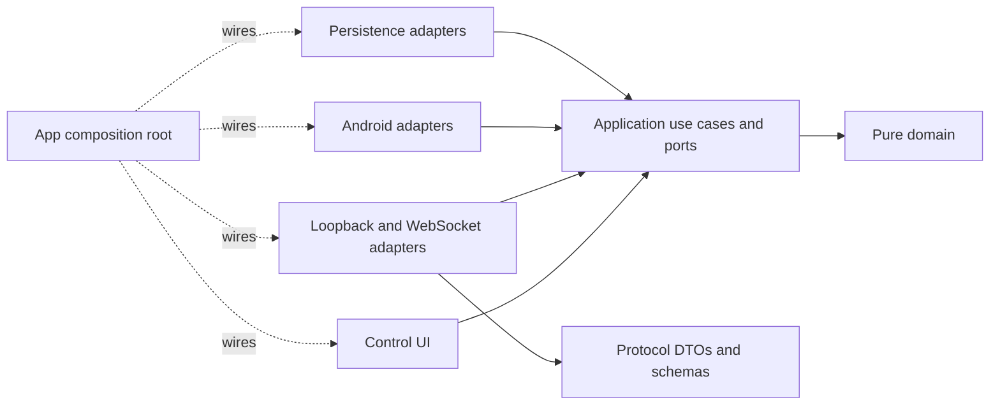
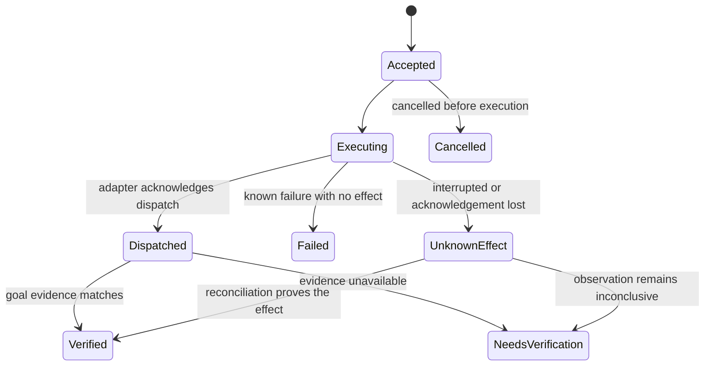

# USIX Companion agent development plan

This plan covers the hexagonal refactor and the work needed for USIX to carry out varied tasks with an Android device. The goal is the capability of an OpenClaw-style assistant: understand a request, choose the right tools, act within the user's authority, check the result, survive interruptions, and report what happened.

This document describes planned development. The Companion baseline is based on source in this repository. Runtime integrations must validate the contracts below against their selected implementations before development; genuine model/device evaluation is part of the milestones.

## 1. Outcome and recommended decisions

The product should support requests such as:

- Find a particular email, summarize its attachments, draft a reply, and send it after the required approval.
- Turn an agreed appointment into a calendar event in the selected account and confirm that it exists.
- Research a subject, produce a cited report in the selected workspace, and deliver the result through the chosen channel.
- React to an opted-in notification, perform a bounded workflow, and recover when the phone disconnects.
- Resume an interrupted job without repeating a message send or claiming an uncertain result as success.

These workflows must work with either USIX runtime and from any launch directory. The source checkout path must not determine available device tools, execution workspace, account, or device identity.

| Decision | Recommendation | Reason |
| --- | --- | --- |
| Responsibility split | Keep Android execution in Companion and planning, models, sessions, memory, and business schedules in the selected runtime. | Avoid competing planners and duplicated task state. |
| Architecture | A pure Kotlin domain/application core, explicit ports, replaceable adapters, and an app composition root. | Make behavior testable without Android and make dependencies enforceable. |
| Runtime integration | One versioned device contract with providers for standalone `usix-code` and full USIX. | Device availability should not depend on whether the runtime host is Termux or Linux. |
| Connection | Preserve authenticated loopback for local use; add a phone-initiated secure WebSocket connection for a remote runtime. | Cover both local Termux and desktop/server execution without exposing the existing HTTP listener. |
| Execution | One active UI controller per phone, durable action receipts, explicit uncertain outcomes, and observation after actions. | Prevent conflicting controllers and unsafe replay. |
| Authority | Task-scoped grants for bounded routine work; explicit, argument-bound approval for consequential actions. | Allow useful multi-step work while retaining user control over external effects. |
| Completion | Goal-specific evidence determines completion. | Model text, an accepted gesture, and a dispatched intent do not prove the requested outcome. |
| Delivery | Keep signed APK distribution as the current deployment path; review a Play distribution separately. | Autonomous accessibility behavior has a material Play policy constraint. |
| Implementation order | Foundations, one complete communication workflow, then scheduling and additional capabilities. | Establish a reusable execution path before multiplying tools. |

These module names, protocol details, and milestones are recommendations for this project. They are not prescribed by OpenClaw or Android. Hexagonal architecture requires the application to remain independent of UI and external systems; Android's modularization guidance also describes abstraction modules with implementations wired by the application module. [Original hexagonal architecture article](https://alistair.cockburn.us/hexagonal-architecture), [Android modularization patterns](https://developer.android.com/topic/modularization/patterns).

## 2. Audited baseline

### Companion

The current project is an Android bridge with one `:app` module. It is not yet hexagonal: business decisions, transport parsing, Android lifecycle, global service references, and JSON representation cross the same boundary.

| Source | Current behavior | Development gap |
| --- | --- | --- |
| [settings.gradle.kts](../settings.gradle.kts) | Includes only `:app`. | No independently compiled core or module dependency checks. |
| [BridgeServer.kt](../app/src/main/java/dev/usix/companion/BridgeServer.kt) | Parses HTTP, validates bodies, maps errors, and calls concrete controllers. Uses a bounded worker pool on `127.0.0.1:8760`. | Transport and use cases are coupled; concurrent requests can contend over one UI; no action journal or negotiated capabilities. |
| [UiController.kt](../app/src/main/java/dev/usix/companion/UiController.kt) | Stores an accessibility service globally and exposes Android/JSON-backed operations. Obtains context from `NotifStore`. | No observation/action ports; unrelated service availability is coupled. |
| [UsixAccessibilityService.kt](../app/src/main/java/dev/usix/companion/UsixAccessibilityService.kt) | Reads text and coordinates; supports gestures, typing, back, and scrolling. Includes useful package checks and node filtering. | Missing stable selectors, snapshot identity, rich node metadata, event-based waits, OCR, and goal verification. |
| [NotifStore.kt](../app/src/main/java/dev/usix/companion/NotifStore.kt) | Keeps up to 50 notifications and live Android reply handles in memory. | Device lifecycle, storage, and reply dispatch share a singleton; no durable event cursor or effect receipt. |
| [NotificationBridgeService.kt](../app/src/main/java/dev/usix/companion/NotificationBridgeService.kt) | Rehydrates active notifications and updates the in-memory store. | Notifications are pull-oriented rather than durable, filtered task triggers. |
| [EmailController.kt](../app/src/main/java/dev/usix/companion/EmailController.kt) | Opens Thunderbird and launches a compose intent. | Draft launch is not an email send, inbox query, or delivery verification. |
| [BridgeAuth.kt](../app/src/main/java/dev/usix/companion/BridgeAuth.kt) | Uses a random token and constant-time token comparison. | Preserve these safeguards; add device identity, scoped sessions, revocation, and remote pairing. |
| [BridgeForegroundService.kt](../app/src/main/java/dev/usix/companion/BridgeForegroundService.kt) | Runs the bridge in a foreground service. | No explicit connection/task recovery state; notification priority and service-type justification need review. |
| [MainActivity.kt](../app/src/main/java/dev/usix/companion/MainActivity.kt) | Provides permission setup and token management. | No task conversation, progress, approval, cancellation, or result history. |
| [app/build.gradle.kts](../app/build.gradle.kts), [.github/workflows/build.yml](../.github/workflows/build.yml) | SDK 34, JDK 17, AGP 8.5.2, CI-provided Gradle 8.10.2, Robolectric tests, APK release workflow. A committed key signs release builds. | Add a wrapper, dependency controls, architecture checks, device validation, and a controlled release-signing migration. |

Existing protections must survive the refactor: loopback binding, authentication before request dispatch, bounded request sizes, package-scoped screen/type/scroll operations, notification reply-handle invalidation, and truthful `sent: false` for compose. Move these into explicit contracts and tests rather than discarding them.

### Runtime integration targets

Support both the standalone `usix-code` runtime and full USIX through the same device contract. Keep integration requirements independent of checkout names, directory layouts and runtime implementation details.

| Runtime | Facilities to reuse where available | Integration requirements |
| --- | --- | --- |
| Standalone `usix-code` | Local model backends, file/shell tools, approvals, saved tasks and Termux capabilities. | Discover paired device tools on Linux and Termux; capture workspace/device/account context; verify goals; recover uncertain effects; keep chat and worker leases independent. |
| Full USIX | Existing planning, tool extensions, client-side execution, authorization, sessions, memory and task services. | Add a Companion provider through authorized extension points; preserve caller identity and dispatch correlation; resolve resources on the owning client; follow the runtime's deployment policy. |

The module refactor applies to Companion. Each runtime retains its own architecture, configuration and security contracts. Its provider maps the shared device contract to existing tool and authorization interfaces. Reuse task services only when their semantics match durable agent execution; do not add a second planner or move application-specific workflows into a generic runtime core.

## 3. Target hexagonal architecture

### Module responsibilities

Use Gradle modules to make the boundary mechanically enforceable. Constructor injection remains plain Kotlin in the core; Android DI belongs in the outer modules.

| Module | Owns | Allowed dependencies |
| --- | --- | --- |
| `:core:domain` | IDs, value objects, action/result states, authority constraints, immutable task/device facts. | Kotlin/JDK APIs that do not perform ambient I/O. |
| `:core:application` | Observe/execute/reconcile use cases, inbound and outbound ports, lease coordination, grant enforcement, recovery policy. | Domain; coroutine primitives if required. |
| `:protocol` | Wire DTOs, codecs, schema/version negotiation, error serialization. | Serialization libraries; no Android services or core business decisions. |
| `:adapters:android` | Accessibility, notifications, app launch, permission/device state, screenshots, OCR, calendar, media and document access. | Application/domain, Android APIs, narrowly selected device libraries. |
| `:adapters:persistence` | Action journal, event outbox, receipts, connection state, preferences and key-backed credential storage. | Application/domain, Room, DataStore, Android Keystore wrappers. |
| `:adapters:transport` | Existing loopback HTTP and outbound secure WebSocket, authentication/session decoding, protocol mapping. | Application/domain, protocol, networking libraries. |
| `:feature:control` | Compose UI, ViewModels, conversation/progress/approval screens, state presentation. | Application/domain and Android UI libraries. |
| `:app` | Manifest, lifecycle entry points, DI graph, service startup and adapter selection. | Modules needed to assemble the application. |
| `:testing:fixtures` | Fakes, shared contract fixtures, a controlled target application for device tests. | Test-only dependencies. |

Arrows above represent source dependencies. At runtime, use cases call the injected outbound port implementations. `:core:application` must never import an Android adapter to perform that call.

Use Hilt to assemble Android-owned components, constructor injection for use cases, Compose with ViewModels and `StateFlow` for the control UI, and lifecycle-aware state collection. Core types receive no Hilt, Android, Room, or serialization annotations. These choices follow supported Android DI and UI patterns while keeping the stronger hexagonal boundary chosen for this project. [Hilt documentation](https://developer.android.com/training/dependency-injection/hilt-android), [Android architecture recommendations](https://developer.android.com/topic/architecture/recommendations).

### Ports and core rules

Define ports around meaningful conversations, not one interface per helper method:

- Inbound: `DeviceQuery`, `ExecuteDeviceAction`, `ReconcileAction`, `ManageControllerSession`, `ObserveDeviceEvents`, and `ManageApprovals`.
- Outbound: `ScreenObservationPort`, `UiActionPort`, `AppLauncherPort`, `NotificationPort`, `DeviceStatePort`, `ActionJournal`, `EventOutbox`, `CredentialVerifier`, `ApprovalStore`, and injected `Clock`/ID generation.
- Add calendar, document, speech and other capability ports when their vertical workflows are introduced. Do not create speculative unused interfaces for every Android API.

The domain uses typed values such as `DeviceId`, `RuntimeId`, `SessionId`, `TaskId`, `ActionId`, `SnapshotId`, `PackageId`, `AccountRef`, and `ApprovalRef`. Neither `Context`, `PendingIntent`, `AccessibilityNodeInfo`, `Intent`, `JSONObject`, nor a database entity crosses a core port. Android handles stay in the adapter and are exposed as scoped, expiring references.

Inject time, dispatchers, storage, identity and environment configuration. Core code must not read wall-clock time, filesystem paths, environment variables, or service globals implicitly. Use explicit application/device coroutine scopes; close them with the owning lifecycle. Marshal Android calls onto the required dispatcher and suspend for callbacks rather than blocking an Android main thread with a latch.

Enforce the boundary with Gradle dependency rules plus forbidden-import/API checks, including ambient time, environment and filesystem calls. The core must compile and run its tests without an Android SDK. Check both direct source imports and dependency leakage; placing Android types behind an interface in the core is still a violation.

### Migration from existing files

| Existing responsibility | Destination |
| --- | --- |
| `BridgeServer.route` validation and decision logic | Application use cases and typed validators; route code only decodes, invokes, and encodes. |
| HTTP parsing/status/authentication | Transport adapter; bounded HTTP behavior remains covered by adapter tests. |
| `UiController` global service/context references | Injected Android capability adapters with explicit connected/disconnected state. |
| `UsixAccessibilityService` tree/gesture operations | Android adapter; lifecycle callbacks publish readiness/events to injected services. |
| `NotifStore` notification values | Domain values and a notification repository contract. |
| `NotifStore` live reply handles | Android notification adapter; reconstruct from active system notifications after reconnect. |
| `NotifStore` event/action history | Persistence adapter with retention and redaction. |
| `EmailController` intent construction | Android mail/app-launch adapter; workflow orchestration belongs to the runtime. |
| `BridgeAuth` preferences/key operations | Credential adapters; pairing and authorization decisions belong to application policies. |
| Activity and foreground-service setup | Thin Android entry points using the composition root. |

The refactor is complete only when business tests invoke application ports directly. Reflection into `BridgeServer.route` and swapping global service fields should disappear from application tests. Existing adapter regressions can continue to use Robolectric.

## 4. Shared device contract and connection model

### Contract ownership and versioning

Create `contracts/device/v2/` in this repository as the source of truth for JSON Schemas, examples, outcome semantics, compatibility rules, and cross-language golden fixtures. Generate or validate Kotlin and Rust wire types from the same definitions. Publish/pin a contract version for both consumers; they must not discover another checkout through a hard-coded relative path at runtime.

This device contract version is independent of full USIX's existing protocol version. Its provider maps commands into the established client-locus dispatch and authorization path. It must preserve request/call correlation and dispatch bindings instead of creating an unguarded execution tunnel.

Keep the current unversioned HTTP endpoints for a bounded migration window, implemented through the same application ports as v2. Legacy mutations that cannot supply the required authority/context must return an upgrade-required result rather than bypass the new rules. A v1 request without a caller-supplied action ID cannot provide safe retry deduplication; prohibit automatic mutation retries on that path. Migrate both runtime providers before enabling autonomous workflows, then deprecate legacy execution after conformance and installed-device upgrade checks.

Every v2 command carries:

| Field | Purpose |
| --- | --- |
| Contract version and request ID | Negotiation and transport correlation. |
| Device/runtime/session/task IDs | Bind the execution to a selected device and initiating session. |
| Action ID and normalized payload hash | Identify the logical attempt and reject ID reuse with different arguments. |
| Controller lease revision | Reject commands from an expired or replaced controller. |
| Deadline and cancellation context | Bound waiting, execution, and recovery. |
| Capability and target package/account | Require an explicit execution scope. |
| Snapshot/reference IDs where relevant | Reject stale UI or expired resource handles. |
| Approval/grant reference where required | Bind permission to the current command and requester. |

A capabilities response distinguishes supported features from current readiness: permission denied, accessibility disconnected, phone locked, application missing, unsupported Android API, offline, or busy. Include contract versions, payload/media limits, and pagination support. An installed tool name is not evidence that a capability is usable now.

Use structured errors such as `UnsupportedCapability`, `PermissionRequired`, `DeviceLocked`, `StaleSnapshot`, `AmbiguousTarget`, `ControllerConflict`, `ApprovalRequired`, `Cancelled`, `DeadlineExceeded`, and `UnknownEffect`. Include whether retry is safe and what observation/recovery is required. Avoid forcing models to infer policy from localized error strings.

### Transports, identity and controller ownership

Keep the loopback listener bound to `127.0.0.1`; never widen it automatically. The remote path is an outbound WSS connection from the phone to a configured trusted endpoint, using an Android-supported client such as OkHttp. Endpoint identity, TLS validation, pairing challenges, session expiry, revocation and replay protection are required; use established crypto libraries and platform key storage. [OkHttp platform support](https://github.com/square/okhttp#requirements), [Android Keystore](https://developer.android.com/privacy-and-security/keystore).

Use these deployment profiles:

| Profile | Planning/task owner | Device connection |
| --- | --- | --- |
| Phone-only | Standalone runtime and local model in Termux. | Authenticated Companion loopback, with the same v2 use cases and receipts. |
| Linux standalone | Standalone runtime on the selected Linux host. | Companion connects by WSS to a supervised device broker on that host. |
| Full USIX | Existing USIX harness and authorization; the selected client handles client-locus execution. | The authorized client-side device provider routes through a paired device broker, retaining dispatch bindings and caller identity. |

The broker manages connections and routes device requests; it does not own models, business schedules or user authorization. A long-lived broker prevents chat/worker processes from opening competing device sessions. On a shared host, its local IPC endpoint is restricted to the owning user. Remote ingress requires pairing and authenticated sessions; full USIX model-server access alone must not create device execution authority.

Maintain one active controller lease per phone across all paired runtimes. Read-only calls may coexist when their privacy scope permits, but UI mutation is serialized at the device boundary. Switching the active controller invalidates old lease revisions and pauses affected tasks. Local user interaction has priority: focus/package changes or explicit user pause interrupt automation.

OpenClaw separates the gateway from device nodes and advertises node capabilities. Its Android design also restricts active device ownership to the focused gateway. Adopt those useful responsibilities and ownership constraints while retaining USIX's own protocols and model policies. [OpenClaw architecture](https://docs.openclaw.ai/concepts/architecture), [OpenClaw Android documentation](https://docs.openclaw.ai/platforms/android).

### Durable receipts and uncertain effects

Use Room for relational action/event records and migrations, DataStore for small configuration/preferences, and Keystore-backed encryption/signing for credentials. These are distinct storage responsibilities; raw bearer secrets and UI contents must not appear in logs. [Room](https://developer.android.com/training/data-storage/room), [DataStore](https://developer.android.com/topic/libraries/architecture/datastore).

Persist an authorized action record before invoking an external effect. Store identity, normalized arguments/hash, grant reference, timestamps, dispatch state, verification evidence references, and the last known outcome. A duplicate action ID with identical authorized context returns the existing receipt; a different payload is rejected. Authenticate and authorize receipt lookup as carefully as execution.

Android effects and the local database cannot commit in one transaction. Therefore do not promise exactly-once external effects. After a process death, lost response or disconnect near a send, inspect and reconcile; never blindly resend. Cancellation after dispatch cannot undo the effect and must report that fact. Retain the standalone runtime's existing action-in-flight recovery protection.

Provide a bounded event outbox with monotonically increasing sequence/cursor values, acknowledgements and explicit gap/resync behavior. The receiver deduplicates by event ID and trigger revision before creating a task. Do not persist `PendingIntent`/`RemoteInput` objects; refresh the live notification handles from Android and invalidate removed or replaced handles.

## 5. Reliable Android actions and truthful completion

### Observe, target, act, verify

Replace flat text/coordinate dumps with snapshots that include package/window identity, generation, capture time, screen bounds, focus, and node references. Nodes include resource ID where available, role/class, full bounds, text/content description, enabled/visible/editable/scrollable state, and parent/child context. Mask password fields and sensitive content before model exposure. Enable resource-ID reporting explicitly in the accessibility configuration.

Target selection should prefer stable semantic attributes and the correct package/window. Reject duplicate-label ambiguity instead of selecting the first substring match. Immediately before an action, revalidate the node and relevant screen state; ephemeral node references are not durable identifiers. Coordinate gestures require bounds and snapshot validation and remain a fallback.

Add click/select/set-text, swipe, long press, back/home, scroll, and bounded waits for a node, window, text or state change. Drive waits through accessibility events and observation predicates with a deadline; use time delays only where an adapter demonstrates they are necessary. Return a new observation or observation reference after each relevant action. Support filtered queries and pagination rather than silently truncating the UI at 80 nodes.

Implement screenshots and on-device OCR as capability-gated fallbacks for WebViews, image-only content, and sparse accessibility trees. Accessibility screenshot capture starts at API 30 and requires the declared screenshot capability; window-specific capture starts at API 34 and secure windows remain restricted. Older supported devices retain accessible-node workflows and report screenshot capability as unavailable. Report unavailable/protected content rather than attempting to bypass it. Start with bundled Latin and Korean OCR models for predictable offline behavior. [AccessibilityService API](https://developer.android.com/reference/android/accessibilityservice/AccessibilityService), [ML Kit text recognition on Android](https://developers.google.com/ml-kit/vision/text-recognition/v2/android).

### Goal verification

The runtime converts the original request into completion criteria and chooses a verifier. Device adapters expose observations/effect evidence; the runtime checks the overall task goal. An LLM may interpret ambiguous content, but it cannot substitute a success sentence for required evidence.

| Goal | Required evidence | Honest fallback |
| --- | --- | --- |
| Open a draft | Expected compose view, account and recipient; draft content when observable. | Draft launch dispatched; content not yet checked. |
| Send email/reply | Requested account, recipient/thread and message matched to sent-state evidence or provider acknowledgement. | Send dispatched or outcome uncertain; stop before a duplicate send. Never imply recipient delivery from an app acknowledgement. |
| Create/update an event | Read back the event ID, calendar/account, time zone and requested fields. | Composer opened or save unverified. |
| Write a report/file | Object reference, contents/hash or requested assertions, and selected workspace. | Write failed or output not verified. |
| Read-only research | Relevant findings, supporting sources and the requested output. | Missing information or source access is reported explicitly. |
| Place a call | Correct target and observed call initiation/status. | Dialler opened; call not confirmed. |

Preserve `email_compose` as a draft operation with `sent: false`. Change notification reply wording so a dispatched `PendingIntent` is not presented as verified delivery. Separate `Dispatched`, `Verified`, `NeedsVerification`, and `UnknownEffect` in tools, task storage, UI and channel messages.

## 6. Authority, privacy and user control

### Grants and approvals

Replace an undifferentiated “approve every mutation” workflow with two explicit mechanisms:

1. A user-authorized task grant permits bounded routine actions within named apps, accounts, resources and a deadline. Examples include opening the selected mail app, reading the selected thread, navigating to its reply composer, and filling an approved draft.
2. A consequential action approval binds the exact operation, recipient/account, normalized content or resource, scope, expiry, task revision and requester. Sending, deleting, purchasing, exporting private data and changing security settings require the appropriate specific authority.

Classification must be enforced outside the model. An unrecognized UI action that could commit an external effect must stop for approval or use a verified workflow adapter; labels such as “OK” are insufficient to infer low risk. A runtime grant cannot override Android permission state or Companion's local capability/target restrictions. Full USIX uses its existing authorization/PDP path, with device checks adding constraints rather than replacing it.

Use one canonical approval record with compare-and-set resolution. Approval from the phone, CLI and another channel must not create conflicting answers or replay a send. After an uncertain approval response, refetch the record and receipt instead of submitting another approval. Approval presentation must show the concrete effect in user language.

### Untrusted content and data boundaries

Treat mail, websites, attachments, OCR, notifications, tool responses and third-party skill text as untrusted data. They cannot grant permissions, change the selected workspace/device/account, authorize another tool, or write privileged instructions into memory. Validate tool arguments, active task context and authority at execution time. Prompt formatting, regex filters or a second model are supplementary controls, not the permission boundary. [OWASP prompt-injection prevention guidance](https://cheatsheetseries.owasp.org/cheatsheets/LLM_Prompt_Injection_Prevention_Cheat_Sheet.html).

Use package/account allowlists, opt-in notification sources, redacted observations, short retention defaults and explicit export controls. Store structured receipts and evidence references; retain raw screens/message bodies only when the user has enabled a justified feature. Provide view/delete/revoke controls for memory, history, tokens, paired runtimes and granted document access. Exclude secrets, complete private screens and message bodies from telemetry by default.

For web/MCP integrations, validate destinations and redirects, bind tokens to the intended audience, and keep credentials out of model-visible arguments. Do not accept token passthrough as authorization. Restrict URL fetch access to local/private networks unless the configured integration explicitly requires and authorizes it. [MCP security guidance](https://modelcontextprotocol.io/specification/latest/basic/security_best_practices).

## 7. Runtime integration, durable work and memory

### Workspace-independent execution

Register device tools through a `DeviceToolProvider`/capability registry in both runtimes. Host detection selects host services; paired device availability selects Android services. Launching standalone USIX from Linux must not remove phone tools, and launching from Termux must not hard-code the source checkout path.

Capture the selected workspace/resource context when a job is created. On standalone, persist its client-resolved root and task policy; on full USIX, preserve client ownership and existing resource/object-reference contracts. Remote tool calls use scoped resource references, with filesystem resolution kept on the owning client. A worker launched from another directory executes against the captured context, never its inherited working directory.

Persist device ID, account/thread/resource references, session/task identity, completion criteria, active grants, progress checkpoint, remaining budget, in-flight action ID, event cursor and delivery destination. Resolve expired handles through fresh observation. Moving a workspace or changing a paired device requires explicit rebinding; silent fallback is unsafe.

### Sessions and agent loop

Keep planning in each runtime's existing harness. Add structured plan/progress state, bounded context compaction, scoped memory retrieval, tool/result budgets and typed failure handling. Replace a fixed turn count as the only stopping rule with cancellation, time/token/tool budgets and goal progress checks. Do not claim that a particular small model is incapable without a genuine evaluation.

Validate model-produced tool calls against the advertised schemas and current capabilities before execution. Reject unknown tools, invalid arguments and missing context with structured results. Preserve tool-call IDs through runtime/device receipts, serialize dependent UI calls, and return bounded observations instead of placing an entire screen/history in every model turn.

Restore a checkpoint by refreshing relevant observations, preserving already committed effects, and checking grants/leases. Retry read-only transient failures with bounded backoff. Failed validation, missing permission, ambiguous targets and uncertain writes need different recovery policies.

Keep ordinary conversation history separate from curated durable preferences and task records. Save lasting facts with provenance, scope and expiry; retrieve only relevant entries and expose correction/deletion. Begin with the runtime's existing storage/search capabilities; add another vector store only if measured retrieval failures justify it. OpenClaw's documented memory model distinguishes durable saved material from the current context window, but the storage format here should follow the selected USIX runtime. [OpenClaw memory](https://docs.openclaw.ai/concepts/memory).

### Workers, triggers and delivery

Separate session execution leases, task-run leases and the phone's UI controller lease. An idle interactive chat must not monopolize the worker lock. Serialize UI mutations per device, allow independent non-device/read-only jobs where safe, and make cancellation effective at bounded checkpoints and device calls.

Use one logical schedule owner in the selected runtime. Support `after`, `every`, calendar schedules with a time zone, notification predicates, webhooks and explicit manual triggers. Define DST behavior, misfire/coalescing policy, overlap handling and trigger deduplication. Persist schedule state before accepting it. OpenClaw documents durable gateway-owned scheduling and result delivery; adopt that separation, using USIX's existing task facilities where they meet the contract. [OpenClaw scheduled jobs](https://docs.openclaw.ai/automation/cron-jobs).

Deliver task status/results to the initiating phone UI, CLI/session or configured channel. Include evidence level, remaining user action and a retry/resume link where supported. Prevent a generated result notification from retriggering its own automation, debounce noisy sources, and support quiet hours and rate limits.

## 8. Android lifecycle and scheduling limits

Business schedules belong to the runtime. Companion owns device availability, pending receipt/event sync and reconnection. Use WorkManager for persistent, constrained recovery/sync jobs; its periodic interval minimum is 15 minutes and its execution is not an exact-time guarantee. It is not a replacement for a one-minute business scheduler. [WorkManager overview](https://developer.android.com/develop/background-work/background-tasks/persistent), [Periodic work and constraints](https://developer.android.com/develop/background-work/background-tasks/persistent/getting-started/define-work).

Use a user-visible foreground connection/session only where the declared service type and current behavior satisfy Android requirements. Review the existing `specialUse` subtype and raise the current notification to the required low-or-higher priority. Background foreground-service starts and while-in-use microphone/camera access are restricted; a granted permission alone does not authorize background capture. [Foreground-service types](https://developer.android.com/develop/background-work/services/fgs/service-types), [Launch requirements](https://developer.android.com/develop/background-work/services/fgs/launch), [Background start restrictions](https://developer.android.com/develop/background-work/services/fgs/restrictions-bg-start).

For a Linux-hosted standalone worker, provide an opt-in user service with restart supervision. For Termux-local operation, integrate its supported service/boot mechanism and document Android/OEM limitations. Full USIX should reuse its existing supervisor and task mechanisms. Exact alarms are reserved for a genuine user-facing alarm requirement, not granted as a blanket agent scheduling escape hatch.

Model `WaitingForDevice`, `WaitingForUnlock`, `PermissionRequired`, `PausedByUser`, `Offline` and `NeedsVerification` visibly. Test reboot, process death, Doze, network loss, service disconnection and user force-stop. Do not promise recovery from force-stop without the user reopening the app, uninterrupted foreground availability, or guaranteed execution at the requested wall-clock time.

## 9. Capability roadmap

Structured provider APIs or platform operations should be preferred when they can express the requested effect and verify it. Tested UI workflows are the fallback for applications without such interfaces. Skills can guide procedures; they do not supply missing permissions, runtime tools or evidence.

| Capability | Recommended implementation | Acceptance example |
| --- | --- | --- |
| Mail | First finish the installed Thunderbird workflow: open/search/read, account/thread targeting, draft, attachment access, approved send and sent-state verification. Add explicit provider connectors when the deployment permits them. | A reply reaches the intended sent state, under the right account, and recovery does not send twice. |
| Notifications and conversations | Opt-in package/thread routing, fresh reply references, read/unread context, durable events and dispatch receipts. Reuse existing channel integrations where available. | An incoming test conversation triggers one bounded task; outgoing notification feedback creates no loop. |
| Calendar | Calendar provider queries/writes with scoped permission/account selection; intent composer when direct permission is unavailable. Intent launch and verified insertion are distinct outcomes. | Create, read back, modify and cancel one event with correct account, time zone and identity. |
| Contacts, SMS and calls | Reuse existing Termux capabilities through the provider; resolve identities and disambiguate contacts. Use permission/role-aware native adapters only when needed. | Duplicate contact names require a choice; sending or calling uses the confirmed target. |
| Web and authenticated browser work | Runtime search/fetch with source attribution; an isolated browser tool/profile for authenticated workflows; device browser interaction when needed. Enforce network and credential boundaries. | Produce a cited report and complete a controlled web form without following embedded tool instructions. |
| Files, documents and attachments | Scoped runtime file tools plus Android Storage Access Framework, persisted URI grants, object references, size/type limits and PDF/text extraction. | Save an attachment/report in the selected workspace and verify its contents; revoked access stops cleanly. |
| Voice | Push-to-talk first, on-device speech recognition where available, explicit unavailable state, and configured speech output. | A Korean spoken request reaches the same approval and verification path as typed input. |
| Camera, photos and visual input | User-invoked capture/picker, permission-aware lifecycle, bounded image handling and local OCR; image/model processing follows the deployment policy. | Extract the requested text without capturing a protected screen or accessing unrelated media. |
| Skills and plugins | Versioned metadata, dependency/capability checks, scoped credentials, reviewed/pinned installation and bounded execution. | A missing capability is reported before execution; untrusted skill text cannot widen authority. |
| MCP integrations | Runtime adapter with explicit server trust, tool schemas, timeouts, budgets, audience-bound credentials and authorization mapping. | A configured service participates in a task with auditable arguments and the same approval rules. |
| Status/location/sensors | Device status first; location or motion only through an enabled, permission-scoped workflow with a concrete user purpose. | Requested context is returned within the granted scope; disabling the capability removes it from readiness. |

Calendar provider access needs the appropriate read/write permissions, while an intent delegates the final operation to the calendar UI. SAF grants can persist across restarts but must be treated as revocable. Android's on-device recognizer requires an availability check and supported API level. [Calendar provider](https://developer.android.com/identity/providers/calendar-provider), [SAF document access](https://developer.android.com/training/data-storage/shared/documents-files), [SpeechRecognizer](https://developer.android.com/reference/android/speech/SpeechRecognizer).

For skills, replace query substring selection alone with manifest validation, required capabilities, versions, trust/provenance and deterministic candidate selection followed by on-demand loading. Preserve user-edited skills and keep secrets outside model-visible instructions. OpenClaw's skill documentation reinforces dependency gating and the need to treat third-party skills as executable/untrusted material. [OpenClaw skills](https://docs.openclaw.ai/tools/skills).

Use existing capabilities in full USIX rather than reimplementing web, memory, process or collaboration tools in Companion. Multi-agent work is a runtime extension for genuinely independent tasks with bounded budgets; phone UI operations still have one controller and explicit task authority.

## 10. Control UI and operational quality

The user-facing application should contain:

- A natural-language conversation and task list with the chosen workspace, device and account where relevant.
- Connection/readiness status and a guided permission/pairing setup that asks only for capabilities being enabled.
- Progress, waiting reason, stop/pause/resume controls and a result history that distinguishes dispatch from verified completion.
- Concrete approval cards with recipient/content/effect, expiry and one authoritative resolved state.
- Notification automation configuration, delivery channel selection, quiet hours and source filters.
- Memory/history controls, document access management, paired-runtime revocation and a visible global automation pause.

Avoid showing protocol hashes, DI concepts or raw stack traces in these flows. Troubleshooting can expose redacted diagnostic details separately. Accessibility, Korean text/input, large fonts and screen rotation are part of the product checks.

For operations, correlate runtime task, device action and transport request IDs in redacted logs. Measure verified task success, false completion, duplicate effects, recovery rate, approval burden, latency, tokens/tool calls, battery and thermal impact. Record supported app/OS versions and selector/workflow revisions. A broken workflow must be disabled or marked unsupported instead of silently applying stale selectors.

### Build and distribution

Add the Gradle wrapper, a version catalog and shared build conventions. Pin a compatible stable AGP/Kotlin/KSP/Gradle/SDK tuple in one reviewed upgrade, preserving `minSdk 24` until a documented dependency or product requirement changes it. Recheck the current official compatibility matrix at implementation time rather than inferring stable availability from a release-note title. [AGP release documentation](https://developer.android.com/build/releases/about-agp).

Add lint/static analysis, core boundary checks, dependency locking where applicable, and reviewed checksum/signature verification. Inspect dependency provenance before accepting generated verification metadata. [Gradle dependency verification](https://docs.gradle.org/current/userguide/dependency_verification.html).

Separate development and controlled release signing. The current committed key is already used for upgrades, so removing it does not revoke existing installations. Preserve the application identity, test Android's supported signing-key migration/update path, and communicate any migration that requires reinstall/data transfer. Keep release secrets outside the repository; verify upgrade behavior before changing published APK signing.

Google Play's accessibility policy prohibits general autonomous initiation/planning/execution through that API, with a disability-support exception that this general assistant must not misdeclare. SMS/call-log access also has role/use restrictions for Play distribution. Therefore the autonomous APK product and any Play offering need an explicit distribution decision and accurate capability declarations; using an alternate permission source is not a Play policy bypass. [AccessibilityService Play policy](https://support.google.com/googleplay/android-developer/answer/10964491?hl=en), [SMS and call-log policy](https://support.google.com/googleplay/android-developer/answer/10208820?hl=en-GB).

## 11. Milestones and dependencies

These phases cover the intended product, not just a minimal refactor. Parallel implementation is appropriate only where boundaries are settled; shared protocol/security decisions and integration validation remain central. `Companion` means this repository, `Standalone` means the `usix-code` runtime, and `Full USIX` means the full runtime integration. Changes in each repository must follow its published contracts and review gates.

| Phase | Depends on | Scope and primary repositories | Required exit evidence |
| --- | --- | --- | --- |
| P0 — Baseline and contracts | None | Companion + both runtimes: capture real workflow baselines; inventory capabilities; agree v2 authority/outcome/workspace contracts; establish wrapper and stable toolchain plan. | Reproducible current build/tests; a genuine local model/device trace from each runtime; supported device/app matrix; committed schema/examples and failure expectations. |
| P1 — Hexagonal foundation | P0 | Companion: extract domain/application, define ports, replace globals with injection, isolate protocol/Android/storage/UI/transport modules, retain v1 endpoints. | Core builds without Android SDK; architectural violations fail CI; all existing bridge regressions pass through thin adapters; application tests use fakes rather than route reflection. |
| P2 — Device execution contract | P1 | Companion + both providers: v2 negotiation, identity/pairing, remote WSS, controller leases, typed errors, durable receipts and event outbox. | Local and remote conformance pass; stale controller rejected; duplicate-ID payload conflict rejected; lost acknowledgements and reboot produce reconciliation without blind replay. |
| P3 — Observation and verification | P2 | Companion + runtime tool bindings: rich snapshots, selectors, waits, stale/ambiguous rejection, screenshot/OCR fallback, cancellation and verifier evidence. | Controlled native/Compose/WebView screens pass; correct package/account retained; protected/unavailable screens reported; dispatch and verified outcomes remain distinct. |
| P4 — Complete agent workflow | P3 | Both runtimes + control UI: captured workspace/device/account, task grants, canonical approvals, goal checks, checkpoint recovery, session history and curated memory. | Mail read → draft → approval → send → verification completes from both runtimes; interruption, rejection and uncertain sends recover safely; launch directory does not change output location. |
| P5 — Durable automation | P4 | Both runtimes + Companion sync: worker lease correction, calendar/relative schedules, notification/webhook triggers, delivery, reconnection/supervision and quiet hours. | Interactive chat does not starve independent jobs; one event creates one task; reboot/offline/Doze/lock states are truthful; missed triggers follow the declared policy. |
| P6 — Communication and calendar | P4; P5 for triggered flows | Companion + runtime workflows: mail attachments/search/thread handling, conversation replies, contact disambiguation, permission-aware SMS/calls, calendar CRUD. | Correct recipient/account/time zone; read-back verification; cancellation and partial results; duplicates and permissions handled explicitly. |
| P7 — Web and document work | P4 | Runtime adapters + Companion document bridge: cited research, authenticated browser profile, scoped files/PDF/attachments, output artifacts and sharing. | Report is sourced and written to the captured workspace; malicious content cannot change authority; revocation and failed access preserve honest status. |
| P8 — Extensible and multimodal work | P5–P7 for the workflows used | Both runtimes + Companion: manifest-gated skills, MCP, voice, camera/photos, optional location/sensor workflows and channel extensions. | Missing dependencies fail before execution; disabled capabilities vanish from readiness; voice/images use the same scope/approval/verification path; model/deployment boundary preserved. |
| P9 — Release and sustained operation | P0–P8 | All repositories: supported-version matrix, genuine end-to-end evaluation, fault tests, battery/latency measurements, signing/upgrade checks, onboarding and runbooks. | Release gates below pass; unsupported cases are declared; update/recovery/rollback paths work; diagnostics and privacy controls are usable. |

Security, protocol conformance and outcome tests run with their corresponding phase, not only in P9. P4 is the first broad vertical milestone; P6–P8 remain part of the roadmap rather than being silently omitted after that milestone.

### Reviewable implementation sequence

Break phases into changes that each have a clear acceptance check:

1. Add wrapper/build conventions and baseline fixtures without changing device behavior.
2. Define domain action/outcome/identity types and pure application ports.
3. Move Android observation/action/notification implementations behind ports; replace globals and route reflection.
4. Complete module split, DI graph and dependency checks.
5. Add v2 schema, Kotlin/Rust golden fixtures, typed capability/readiness negotiation and v1 mapping.
6. Add journal/outbox migrations, idempotency checks and uncertain-effect reconciliation.
7. Add pairing/WSS/device lease enforcement and both runtime providers through their existing authorization paths.
8. Add rich snapshots, targeting/waits, package/staleness checks and cancellation.
9. Add screenshot/OCR adapters and goal evidence; preserve draft semantics.
10. Capture job context, correct worker locking, and introduce task grants/canonical approvals/goal-based completion.
11. Deliver the mail vertical workflow and phone conversation/progress/approval UI.
12. Add schedules/events/supervision/delivery, then calendar and communication workflows.
13. Add browser/document workflows, curated memory controls and artifact access.
14. Add gated skills/MCP/multimodal capabilities and finish the release/upgrade/device matrix.

Each change includes tests for its failure boundary. Do not combine toolchain modernization, an authorization rewrite and UI behavior changes in one unreviewable change. Calendar estimates follow P0's device/model baseline and repository ownership; an unsupported estimate before those dependencies are known would not improve the plan.

## 12. Validation and release gates

### Test strategy

| Layer | What it proves |
| --- | --- |
| Pure core tests | Grant scope, leases, action states, deadline/cancellation, outcome reconciliation and recovery using deterministic clocks/fakes. |
| Protocol conformance | Kotlin/Rust share schemas and fixtures; versions, limits, malformed payloads, identity binding and errors agree. |
| Android adapter tests | Package selection, notification handle replacement, permission changes, intents, persistence migrations and service state using Robolectric where suitable. |
| Controlled device tests | Real gestures and observations on a fixture app with repeated labels, native/Compose/WebView content, async updates and Korean/English input. |
| Runtime integration tests | Linux and Termux standalone profiles plus full USIX client-locus execution; alternate working directories, approval resolution, worker concurrency and model policies. |
| Genuine workflow evaluation | Real model output and physical-device behavior in controlled accounts, with actual goal evidence and interruption scenarios. Stub output cannot satisfy this gate. |
| Upgrade/operations tests | APK updates, signing migration, database migrations, revocation, reboot, offline recovery, event gaps, battery and diagnostic redaction. |

Use controlled test accounts/messages/attachments rather than collecting existing private user data as an evaluation corpus. Record the device, Android version, app version, model/backend, workflow revision and counts for every evaluation. CI-only Android compilation is not proof of mobile runtime behavior.

### Mandatory scenarios

- Launch the same task from two unrelated directories and execute it after the worker restarts elsewhere; output remains in the captured workspace.
- Run Android tools from Linux standalone, Termux standalone and full USIX through the same device contract.
- Connect two runtimes; only the selected controller can mutate the phone.
- Interrupt immediately before/after a send, drop the response, and restart; no blind duplicate send occurs.
- Reuse an action ID with altered recipient/body; reject it without dispatch.
- Revoke or expire permission, pairing, document access, grant or controller lease during a task; stop with the correct state.
- Present two identical UI labels, rotate the screen, change focus, open the keyboard, and switch apps; do not act on stale or ambiguous targets.
- Put tool instructions inside email, a web page, attachment text and OCR; they cannot obtain additional authority or change the workspace/account.
- Submit competing approvals from UI and CLI; one committed answer governs execution.
- Open an email draft, initiate a call, or dispatch a reply without proof; do not mark the business goal completed.
- Kill services/processes, lock the phone, enter Doze, disconnect the network and create an event-cursor gap; recover or explain what is waiting.
- Keep chat open while a scheduled independent task becomes due; it can run within declared resource constraints.
- Deny screenshots, microphone, notifications and calendar access separately; unrelated enabled tools continue to work.
- Cancel before dispatch and after dispatch; report the actual effect state in both cases.
- Upgrade an existing APK/database and revoke a runtime; preserve data and remove its execution authority as intended.

### Proposed release thresholds

These are project recommendations, not measured current results or universal industry thresholds:

- Zero unauthorized effects, false verified-completion reports, or blind duplicate effects in the mandatory safety/fault suite.
- All critical happy-path workflows pass five consecutive genuine runs on each declared runtime/device profile.
- At least 90% verified completion across a published normal-task suite of at least 50 cases; publish counts and failure categories so the percentage is interpretable.
- Every request/action wait has a bounded deadline; cancellation, offline and approval waiting are visible. Record latency, approval burden and battery/thermal baselines in P0, then publish the budget for each supported workflow before release.
- Core dependency checks, protocol tests, migrations, lint/static checks and required device validation pass. Unsupported apps/APIs/capabilities are declared accurately.

Future release criteria should be revised deliberately when scope or baseline evidence changes; do not improve a score by treating a dispatched or abandoned task as completed.

## 13. Completion definition for the roadmap

The refactor is finished when the core has enforceable inward dependencies, adapters can be replaced by fakes, Android lifecycle/transport code contains no task policy, and both runtimes use the shared device contract through their own authorized tool paths.

The assistant capability work is finished when the supported workflows cover communication, calendar, web/document work, scheduling/events and configured extensions; they run with captured context, scoped authority, observable progress, verified outcomes and safe recovery. Remaining platform limitations must be shown as explicit capability or waiting states.

This plan deliberately builds one dependable execution system before broadening integrations. Adding more endpoint names or allowing a model to keep calling tools does not satisfy those completion criteria.
