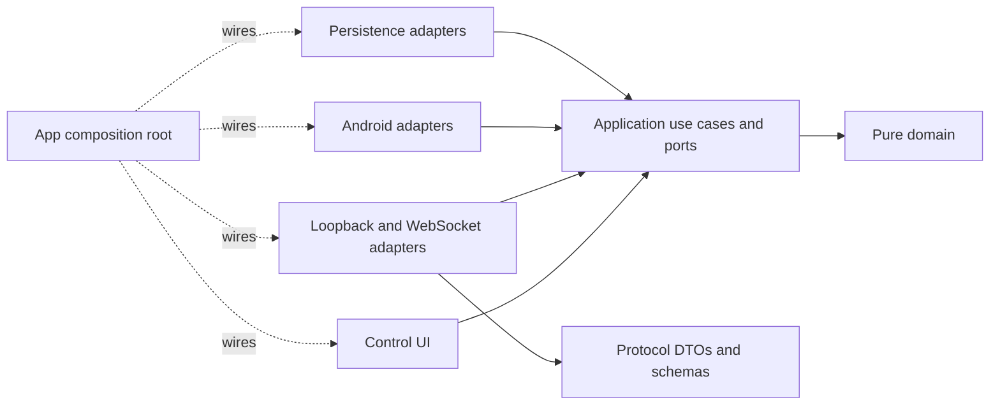
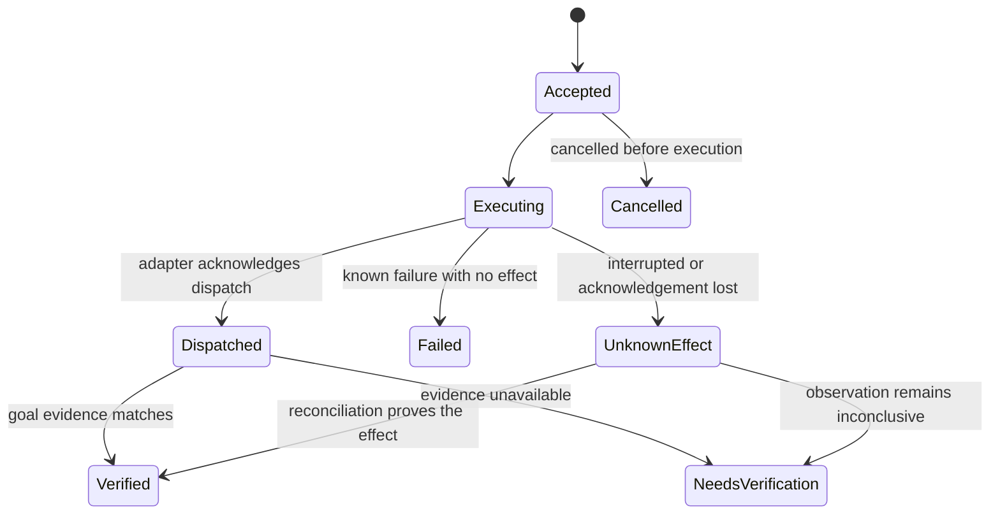

# USIX Companion agent development plan

This plan covers the hexagonal refactor and the work needed for USIX to carry out varied tasks with an Android device. The goal is the capability of an OpenClaw-style assistant: understand a request, choose the right tools, act within the user's authority, check the result, survive interruptions, and report what happened.

This document describes planned development. The Companion baseline is based on source in this repository. Integrations must validate the contracts below against the unchanged runtime implementations before development; genuine model/device evaluation is part of the milestones.

### Required compatibility and change boundary

Both `../usix` and `../usix-termux` are required integration targets. Neither USIX codebase may be changed. Implement the Android refactor, device contract, host CLI/broker, optional external MCP server, skill instructions, packaging and integration tests in this Companion repository. Do not add runtime providers to USIX source, alter its tool registry, patch its model loop, change worker locking, regenerate its wire types, or require a custom USIX build.

Use existing runtime tools and supported configuration/extension interfaces. Runtime-specific configuration examples and skill material live here and may be installed through existing user-level mechanisms outside the runtime source trees; configuration cannot bypass the runtime's authorization or deployment policy. Inspect both checkouts read-only and record their revisions for compatibility tests. A missing interface or permission is a declared compatibility limitation, not permission to patch USIX.

The relative paths above identify the development checkouts to validate. They are not runtime lookup paths: an installed Companion integration must work from either checkout and unrelated directories, using explicit connection configuration and a captured workspace/device/account context.

### Chapter completion, document deletion and next start

The implementation chapters are P0–P9 in section 11; the numbered sections 1–13 provide their design and acceptance criteria. Start one requested chapter at a time, following the dependency table. The default sequence is P0 → P1 → P2 → P3 → P4 → P5 → P6 → P7 → P8 → P9.

1. When a chapter starts, create its temporary execution document at `docs/chapters/P<N>.md`. Record its scope, prerequisites, implementation steps, required checks, progress, and next chapter. Keep all work within the Companion change boundary above.
2. A chapter ends only after its implementation and required exit checks pass. Preserve its execution document while work, required device/runtime evidence, or blocking issues remain; stopping a session does not complete a chapter.
3. On completion, record the verified result and context needed by the next chapter in this plan, update references to the completed execution document, and delete `docs/chapters/P<N>.md` plus temporary planning documents created solely for that chapter. This cleanup is part of the requested chapter work. Shared contracts, permanent product documentation and test/evaluation evidence remain the acceptance sources for subsequent work.
4. End every completed chapter with a concise report of the result, verification, deleted document paths, and the exact next-start instruction. Print the next instruction in a copyable code block; substitute the next chapter's actual ID. Wait for the user to start the next chapter.
5. After P9 and all roadmap release gates pass, delete its temporary execution document and this `docs/agent-development-plan.md` file. Update the README and other references in the same change to point to the permanent product/architecture/contract documentation. Report roadmap completion; there is no P10 start instruction.

The next-start instructions are chat requests, not new USIX shell subcommands. Use this template with the actual chapter ID:

```text
docs/agent-development-plan.md를 읽고 P<N>을 시작해. ../usix와 ../usix-termux 코드는 변경하지 말고 양쪽에서 실행 가능해야 해. 완료 조건을 검증한 뒤 해당 챕터 작업 문서를 삭제하고 다음 챕터 시작 명령어를 알려줘.
```

## 1. Outcome and recommended decisions

The product should support requests such as:

- Find a particular email, summarize its attachments, draft a reply, and send it after the required approval.
- Turn an agreed appointment into a calendar event in the selected account and confirm that it exists.
- Research a subject, produce a cited report in the selected workspace, and deliver the result through the chosen channel.
- React to an opted-in notification, perform a bounded workflow, and recover when the phone disconnects.
- Resume an interrupted job without repeating a message send or claiming an uncertain result as success.

These workflows must work with either USIX runtime and from any launch directory. The source checkout path must not determine available device tools, execution workspace, account, or device identity.

| Decision | Recommendation | Reason |
| --- | --- | --- |
| Responsibility split | Keep Android execution in Companion and reuse the selected runtime's existing planning, models, sessions, memory and scheduling facilities. | Avoid competing planners; absent runtime facilities remain explicit limitations. |
| Architecture | A pure Kotlin domain/application core, explicit ports, replaceable adapters, and an app composition root. | Make behavior testable without Android and make dependencies enforceable. |
| Runtime integration | One versioned device contract with Companion-owned external integration for unchanged `../usix` and `../usix-termux`. | Support both runtimes without adding or modifying USIX code; device availability must not depend on the host or checkout path. |
| Connection | Preserve authenticated loopback for local use; add a phone-initiated secure WebSocket connection for a remote runtime. | Cover both local Termux and desktop/server execution without exposing the existing HTTP listener. |
| Execution | One active UI controller per phone, durable action receipts, explicit uncertain outcomes, and observation after actions. | Prevent conflicting controllers and unsafe replay. |
| Authority | Companion task-scoped grants for bounded routine work; explicit, argument-bound approval for consequential actions, in addition to existing runtime gates. | Retain user control without changing or bypassing USIX approval policy. |
| Completion | Goal-specific evidence determines completion. | Model text, an accepted gesture, and a dispatched intent do not prove the requested outcome. |
| Delivery | Keep signed APK distribution as the current deployment path; review a Play distribution separately. | Autonomous accessibility behavior has a material Play policy constraint. |
| Implementation order | Foundations, one complete communication workflow, then scheduling and additional capabilities. | Establish a reusable execution path before multiplying tools. |

These module names, protocol details, and milestones are recommendations for this project. They are not prescribed by OpenClaw or Android. Hexagonal architecture requires the application to remain independent of UI and external systems; Android's modularization guidance also describes abstraction modules with implementations wired by the application module. [Original hexagonal architecture article](https://alistair.cockburn.us/hexagonal-architecture), [Android modularization patterns](https://developer.android.com/topic/modularization/patterns).

## 2. Audited baseline

### Companion

At the P0 audit, the project was an Android bridge with one `:app` module: business decisions, transport parsing, Android lifecycle, global service references and JSON representation crossed the same boundary. The table records that historical starting point. P1's current module/port implementation and verified checks are in [the architecture guide](architecture.md) and [foundation evidence](evidence/P1-foundation.md); the retired filenames below are historical names.

| P0 source | Audited P0 behavior | Development gap at P0 |
| --- | --- | --- |
| [settings.gradle.kts](../settings.gradle.kts) | Includes only `:app`. | No independently compiled core or module dependency checks. |
| `BridgeServer.kt` (retired in P1) | Parses HTTP, validates bodies, maps errors, and calls concrete controllers. Uses a bounded worker pool on `127.0.0.1:8760`. | Transport and use cases are coupled; concurrent requests can contend over one UI; no action journal or negotiated capabilities. |
| `UiController.kt` (retired in P1) | Stores an accessibility service globally and exposes Android/JSON-backed operations. Obtains context from `NotifStore`. | No observation/action ports; unrelated service availability is coupled. |
| [UsixAccessibilityService.kt](../app/src/main/java/dev/usix/companion/UsixAccessibilityService.kt) | Reads text and coordinates; supports gestures, typing, back, and scrolling. Includes useful package checks and node filtering. | Missing stable selectors, snapshot identity, rich node metadata, event-based waits, OCR, and goal verification. |
| `NotifStore.kt` (retired in P1) | Keeps up to 50 notifications and live Android reply handles in memory. | Device lifecycle, storage, and reply dispatch share a singleton; no durable event cursor or effect receipt. |
| [NotificationBridgeService.kt](../app/src/main/java/dev/usix/companion/NotificationBridgeService.kt) | Rehydrates active notifications and updates the in-memory store. | Notifications are pull-oriented rather than durable, filtered task triggers. |
| `EmailController.kt` (retired in P1) | Opens Thunderbird and launches a compose intent. | Draft launch is not an email send, inbox query, or delivery verification. |
| `BridgeAuth.kt` (retired in P1) | Uses a random token and constant-time token comparison. | Preserve these safeguards; add device identity, scoped sessions, revocation, and remote pairing. |
| [BridgeForegroundService.kt](../app/src/main/java/dev/usix/companion/BridgeForegroundService.kt) | Runs the bridge in a foreground service. | No explicit connection/task recovery state; notification priority and service-type justification need review. |
| [MainActivity.kt](../app/src/main/java/dev/usix/companion/MainActivity.kt) | Provides permission setup and token management. | No task conversation, progress, approval, cancellation, or result history. |
| [app/build.gradle.kts](../app/build.gradle.kts), [.github/workflows/build.yml](../.github/workflows/build.yml) | SDK 34, JDK 17, AGP 8.5.2, CI-provided Gradle 8.10.2, Robolectric tests, APK release workflow. A committed key signs release builds. | Add a wrapper, dependency controls, architecture checks, device validation, and a controlled release-signing migration. |

Existing protections must survive the refactor: loopback binding, authentication before request dispatch, bounded request sizes, package-scoped screen/type/scroll operations, notification reply-handle invalidation, and truthful `sent: false` for compose. Move these into explicit contracts and tests rather than discarding them.

### Runtime integration targets

Support `../usix` and `../usix-termux` through the same device contract without changing either codebase. Keep deployed integration independent of checkout names and directory layouts. The current `usix-code` crate in `../usix` is a CLI client of the USIX daemon, not a separate local-model runtime; the phone-local runtime target is `usix-termux`.

| Runtime | Existing integration surface | Companion-owned integration requirements |
| --- | --- | --- |
| USIX (`../usix`) | Existing client-locus shell/process execution under CLI/operator policy; configured MCP where its existing admission, scope and approval rules permit it. | Call the external Companion CLI through existing tools, or configure an external MCP server without source changes. Preserve caller identity and dispatch correlation, keep local resources on the owning client, and follow deployment policy. |
| `usix-termux` (`../usix-termux`) | Existing approval-gated `shell`, user-loaded Markdown skills, and built-in Companion HTTP tools. | Call the same external Companion CLI through `shell` for v2/new capabilities; preserve supported built-in HTTP calls. Provide skill/configuration examples without adding tools to the runtime registry. |

The baseline above is supported by the read-only runtime audit: USIX's `docs/contracts/27-tools.md` defines client execution and its policy gates; `usix-termux/src/tools/mod.rs` registers `shell` and bridge tools, and `src/tools/shell.rs` executes approved external commands. These interfaces are not proof of an end-to-end workflow. P0 must record actual supported versions, command/output limits, configuration and genuine traces from both unchanged runtimes.

The module refactor applies only to Companion. Each runtime retains its architecture, tool catalog, model policy and security contracts. The external integration translates calls into the device contract; it does not register a new built-in tool, install code inside a runtime checkout, create a second planner, or rewrite runtime task/memory storage. Reuse existing task services only when their current semantics match the workflow. In particular, `usix-termux` classifies `shell` as mutating, so even a read-only CLI command can require runtime approval; Companion grants cannot remove that prompt.

## 3. Target hexagonal architecture

### Module responsibilities

Use Gradle modules to make the boundary mechanically enforceable. Constructor injection remains plain Kotlin in the core; Android DI belongs in the outer modules.

| Module | Owns | Allowed dependencies |
| --- | --- | --- |
| `:core:domain` | IDs, value objects, action/result states, authority constraints, immutable task/device facts. | Kotlin/JDK APIs that do not perform ambient I/O. |
| `:core:application` | Observe/execute/reconcile use cases, inbound and outbound ports, lease coordination, grant enforcement, recovery policy. | Domain; coroutine primitives if required. |
| `:protocol` | Wire DTOs, codecs, schema/version negotiation, error serialization. | Serialization libraries; no Android services or core business decisions. |
| `:adapters:android` | Accessibility, notifications, app launch, permission/device state, screenshots, OCR, calendar, media and document access. | Application/domain, Android APIs, narrowly selected device libraries. |
| `:adapters:persistence` | Action journal, event outbox, receipts, connection state, preferences and key-backed credential storage. | Application/domain, Room, DataStore, Android Keystore wrappers. |
| `:adapters:transport` | Existing loopback HTTP and outbound secure WebSocket, authentication/session decoding, protocol mapping. | Application/domain, protocol, networking libraries. |
| `:feature:control` | Compose UI, ViewModels, conversation/progress/approval screens, state presentation. | Application/domain and Android UI libraries. |
| `:app` | Manifest, lifecycle entry points, DI graph, service startup and adapter selection. | Modules needed to assemble the application. |
| `:testing:fixtures` | Fakes, shared contract fixtures, a controlled target application for device tests. | Test-only dependencies. |



Arrows above represent source dependencies. At runtime, use cases call the injected outbound port implementations. `:core:application` must never import an Android adapter to perform that call.

Use Hilt to assemble Android-owned components, constructor injection for use cases, Compose with ViewModels and `StateFlow` for the control UI, and lifecycle-aware state collection. Core types receive no Hilt, Android, Room, or serialization annotations. These choices follow supported Android DI and UI patterns while keeping the stronger hexagonal boundary chosen for this project. [Hilt documentation](https://developer.android.com/training/dependency-injection/hilt-android), [Android architecture recommendations](https://developer.android.com/topic/architecture/recommendations).

### Ports and core rules

Define ports around meaningful conversations, not one interface per helper method:

- Inbound: `DeviceQuery`, `ExecuteDeviceAction`, `ReconcileAction`, `ManageControllerSession`, `ObserveDeviceEvents`, and `ManageApprovals`.
- Outbound: `ScreenObservationPort`, `UiActionPort`, `AppLauncherPort`, `NotificationPort`, `DeviceStatePort`, `ActionJournal`, `EventOutbox`, `CredentialVerifier`, `ApprovalStore`, and injected `Clock`/ID generation.
- Add calendar, document, speech and other capability ports when their vertical workflows are introduced. Do not create speculative unused interfaces for every Android API.

The domain uses typed values such as `DeviceId`, `RuntimeId`, `SessionId`, `TaskId`, `ActionId`, `SnapshotId`, `PackageId`, `AccountRef`, and `ApprovalRef`. Neither `Context`, `PendingIntent`, `AccessibilityNodeInfo`, `Intent`, `JSONObject`, nor a database entity crosses a core port. Android handles stay in the adapter and are exposed as scoped, expiring references.

Inject time, dispatchers, storage, identity and environment configuration. Core code must not read wall-clock time, filesystem paths, environment variables, or service globals implicitly. Use explicit application/device coroutine scopes; close them with the owning lifecycle. Marshal Android calls onto the required dispatcher and suspend for callbacks rather than blocking an Android main thread with a latch.

Enforce the boundary with Gradle dependency rules plus forbidden-import/API checks, including ambient time, environment and filesystem calls. The core must compile and run its tests without an Android SDK. Check both direct source imports and dependency leakage; placing Android types behind an interface in the core is still a violation.

### Migration from existing files

| Existing responsibility | Destination |
| --- | --- |
| `BridgeServer.route` validation and decision logic | Application use cases and typed validators; route code only decodes, invokes, and encodes. |
| HTTP parsing/status/authentication | Transport adapter; bounded HTTP behavior remains covered by adapter tests. |
| `UiController` global service/context references | Injected Android capability adapters with explicit connected/disconnected state. |
| `UsixAccessibilityService` tree/gesture operations | Android adapter; lifecycle callbacks publish readiness/events to injected services. |
| `NotifStore` notification values | Domain values and a notification repository contract. |
| `NotifStore` live reply handles | Android notification adapter; reconstruct from active system notifications after reconnect. |
| `NotifStore` event/action history | Persistence adapter with retention and redaction. |
| `EmailController` intent construction | Android mail/app-launch adapter; workflow orchestration belongs to the runtime. |
| `BridgeAuth` preferences/key operations | Credential adapters; pairing and authorization decisions belong to application policies. |
| Activity and foreground-service setup | Thin Android entry points using the composition root. |

The refactor is complete only when business tests invoke application ports directly. Reflection into `BridgeServer.route` and swapping global service fields should disappear from application tests. Existing adapter regressions can continue to use Robolectric.

## 4. Shared device contract and connection model

### Contract ownership and versioning

Create `contracts/device/v2/` in this repository as the source of truth for JSON Schemas, examples, outcome semantics, compatibility rules, and cross-language golden fixtures. Generate or validate Kotlin and external host-integration wire types here from the same definitions; do not regenerate or change either USIX runtime's types. Publish/pin the contract version for the APK and external integration package. Neither consumer may discover a USIX checkout through a hard-coded relative path at runtime.

This device contract version is independent of USIX's existing protocol version. The Companion-owned CLI/MCP integration is invoked through existing authorized execution paths. Preserve available request/call correlation and dispatch bindings; verify the actual identity/scope carried by each interface instead of trusting model-supplied IDs or assuming that a shell invocation carries a full USIX dispatch binding. A profile without the binding required by a workflow must report it as unsupported.

Keep the current unversioned HTTP endpoints compatible with unchanged `usix-termux` tools, implemented through the same application ports as v2. Do not require a runtime source change or make new v2 fields mandatory in existing requests. Preserve supported response fields and authentication. Compatibility does not supply missing authority: a legacy effect without sufficient context must fail clearly or obtain specific local Companion approval. A v1 request without a caller-supplied action ID cannot provide safe retry deduplication; prohibit automatic mutation retries and report its limited guarantees. Use the external v2 integration for new autonomous workflows. Retiring legacy endpoints requires separate compatibility evidence and an explicit decision; it is not a prerequisite for this refactor.

Provide an installable host CLI with structured JSON request/result handling, bounded calls and receipt/event queries. Resolve connection settings and credentials explicitly, independently of `cwd`; keep bearer secrets out of command arguments and model-visible output. Package the broker, optional MCP server, workflow instructions and both runtime setup examples here. A skill describes how to call existing tools; it cannot add a native tool to a frozen runtime registry.

Every v2 command carries:

| Field | Purpose |
| --- | --- |
| Contract version and request ID | Negotiation and transport correlation. |
| Device/runtime/session/task IDs | Bind the execution to a selected device and initiating session. |
| Action ID and normalized payload hash | Identify the logical attempt and reject ID reuse with different arguments. |
| Controller lease revision | Reject commands from an expired or replaced controller. |
| Deadline and cancellation context | Bound waiting, execution, and recovery. |
| Capability and target package/account | Require an explicit execution scope. |
| Snapshot/reference IDs where relevant | Reject stale UI or expired resource handles. |
| Approval/grant reference where required | Bind permission to the current command and requester. |

A capabilities response distinguishes supported features from current readiness: permission denied, accessibility disconnected, phone locked, application missing, unsupported Android API, offline, or busy. Include contract versions, payload/media limits, and pagination support. An installed tool name is not evidence that a capability is usable now.

Use structured errors such as `UnsupportedCapability`, `PermissionRequired`, `DeviceLocked`, `StaleSnapshot`, `AmbiguousTarget`, `ControllerConflict`, `ApprovalRequired`, `Cancelled`, `DeadlineExceeded`, and `UnknownEffect`. Include whether retry is safe and what observation/recovery is required. Avoid forcing models to infer policy from localized error strings.

### Transports, identity and controller ownership

Keep the loopback listener bound to `127.0.0.1`; never widen it automatically. The remote path is an outbound WSS connection from the phone to a configured trusted endpoint, using an Android-supported client such as OkHttp. Endpoint identity, TLS validation, pairing challenges, session expiry, revocation and replay protection are required; use established crypto libraries and platform key storage. [OkHttp platform support](https://github.com/square/okhttp#requirements), [Android Keystore](https://developer.android.com/privacy-and-security/keystore).

Use these deployment profiles:

| Profile | Planning/task owner | Device connection |
| --- | --- | --- |
| Phone-local `usix-termux` | Unchanged `usix-termux` and its configured local model. | Its existing tools use authenticated loopback; its existing `shell` invokes the Companion CLI for v2 use cases and receipts. |
| USIX on Termux or Linux | Unchanged USIX harness and authorization; its selected client handles client-locus execution. | Existing authorized client shell execution invokes the Companion CLI, or existing policy permits an external MCP connection. The integration uses local loopback or the paired broker as appropriate. |
| Remote host integration | The selected unchanged runtime; host support must be established in P0. | The phone connects by WSS to the Companion-owned supervised broker. Use the same external CLI/device contract; do not widen the Android HTTP listener or patch runtime host detection. |

The broker manages connections and routes device requests; it does not own models, business schedules or user authorization. A long-lived broker prevents chat/worker processes from opening competing device sessions. On a shared host, its local IPC endpoint is restricted to the owning user. Remote ingress requires pairing and authenticated sessions; full USIX model-server access alone must not create device execution authority.

Maintain one active controller lease per phone across all paired runtimes. Read-only calls may coexist when their privacy scope permits, but UI mutation is serialized at the device boundary. Switching the active controller invalidates old lease revisions and pauses affected tasks. Local user interaction has priority: focus/package changes or explicit user pause interrupt automation.

OpenClaw separates the gateway from device nodes and advertises node capabilities. Its Android design also restricts active device ownership to the focused gateway. Adopt those useful responsibilities and ownership constraints while retaining USIX's own protocols and model policies. [OpenClaw architecture](https://docs.openclaw.ai/concepts/architecture), [OpenClaw Android documentation](https://docs.openclaw.ai/platforms/android).

### Durable receipts and uncertain effects

Use Room for relational action/event records and migrations, DataStore for small configuration/preferences, and Keystore-backed encryption/signing for credentials. These are distinct storage responsibilities; raw bearer secrets and UI contents must not appear in logs. [Room](https://developer.android.com/training/data-storage/room), [DataStore](https://developer.android.com/topic/libraries/architecture/datastore).

Persist an authorized action record before invoking an external effect. Store identity, normalized arguments/hash, grant reference, timestamps, dispatch state, verification evidence references, and the last known outcome. A duplicate action ID with identical authorized context returns the existing receipt; a different payload is rejected. Authenticate and authorize receipt lookup as carefully as execution.



Android effects and the local database cannot commit in one transaction. Therefore do not promise exactly-once external effects. After a process death, lost response or disconnect near a send, inspect and reconcile; never blindly resend. Cancellation after dispatch cannot undo the effect and must report that fact. Preserve any existing runtime recovery protection; the Companion journal and external integration must also enforce recovery without requiring runtime changes.

Provide a bounded event outbox with monotonically increasing sequence/cursor values, acknowledgements and explicit gap/resync behavior. The receiver deduplicates by event ID and trigger revision before creating a task. Do not persist `PendingIntent`/`RemoteInput` objects; refresh the live notification handles from Android and invalidate removed or replaced handles.

## 5. Reliable Android actions and truthful completion

### Observe, target, act, verify

Replace flat text/coordinate dumps with snapshots that include package/window identity, generation, capture time, screen bounds, focus, and node references. Nodes include resource ID where available, role/class, full bounds, text/content description, enabled/visible/editable/scrollable state, and parent/child context. Mask password fields and sensitive content before model exposure. Enable resource-ID reporting explicitly in the accessibility configuration.

Target selection should prefer stable semantic attributes and the correct package/window. Reject duplicate-label ambiguity instead of selecting the first substring match. Immediately before an action, revalidate the node and relevant screen state; ephemeral node references are not durable identifiers. Coordinate gestures require bounds and snapshot validation and remain a fallback.

Add click/select/set-text, swipe, long press, back/home, scroll, and bounded waits for a node, window, text or state change. Drive waits through accessibility events and observation predicates with a deadline; use time delays only where an adapter demonstrates they are necessary. Return a new observation or observation reference after each relevant action. Support filtered queries and pagination rather than silently truncating the UI at 80 nodes.

Implement screenshots and on-device OCR as capability-gated fallbacks for WebViews, image-only content, and sparse accessibility trees. Accessibility screenshot capture starts at API 30 and requires the declared screenshot capability; window-specific capture starts at API 34 and secure windows remain restricted. Older supported devices retain accessible-node workflows and report screenshot capability as unavailable. Report unavailable/protected content rather than attempting to bypass it. Start with bundled Latin and Korean OCR models for predictable offline behavior. [AccessibilityService API](https://developer.android.com/reference/android/accessibilityservice/AccessibilityService), [ML Kit text recognition on Android](https://developers.google.com/ml-kit/vision/text-recognition/v2/android).

### Goal verification

The selected runtime interprets the original request using its existing harness. Companion-owned workflow instructions and typed integration requests carry explicit completion criteria, and the integration/device adapters return verifier evidence. Use existing runtime goal checks where available; otherwise the Companion workflow receipt and control UI must still distinguish verified effects from dispatched or uncertain effects. Do not change the runtime's stopping rules or promise control over its final prose. An LLM may interpret ambiguous content, but it cannot substitute a success sentence for required evidence.

| Goal | Required evidence | Honest fallback |
| --- | --- | --- |
| Open a draft | Expected compose view, account and recipient; draft content when observable. | Draft launch dispatched; content not yet checked. |
| Send email/reply | Requested account, recipient/thread and message matched to sent-state evidence or provider acknowledgement. | Send dispatched or outcome uncertain; stop before a duplicate send. Never imply recipient delivery from an app acknowledgement. |
| Create/update an event | Read back the event ID, calendar/account, time zone and requested fields. | Composer opened or save unverified. |
| Write a report/file | Object reference, contents/hash or requested assertions, and selected workspace. | Write failed or output not verified. |
| Read-only research | Relevant findings, supporting sources and the requested output. | Missing information or source access is reported explicitly. |
| Place a call | Correct target and observed call initiation/status. | Dialler opened; call not confirmed. |

Preserve `email_compose` as a draft operation with `sent: false`. Change notification reply wording so a dispatched `PendingIntent` is not presented as verified delivery. Separate `Dispatched`, `Verified`, `NeedsVerification`, and `UnknownEffect` in tools, task storage, UI and channel messages.

## 6. Authority, privacy and user control

### Grants and approvals

Provide two explicit Companion authority mechanisms in addition to the unchanged runtime's existing approval gates:

1. A user-authorized task grant permits bounded routine actions within named apps, accounts, resources and a deadline. Examples include opening the selected mail app, reading the selected thread, navigating to its reply composer, and filling an approved draft.
2. A consequential action approval binds the exact operation, recipient/account, normalized content or resource, scope, expiry, task revision and requester. Sending, deleting, purchasing, exporting private data and changing security settings require the appropriate specific authority.

Classification must be enforced outside the model. An unrecognized UI action that could commit an external effect must stop for approval or use a verified workflow adapter; labels such as “OK” are insufficient to infer low risk. A runtime grant cannot override Android permission state or Companion's local capability/target restrictions. USIX uses its existing authorization/PDP path, with device checks adding constraints rather than replacing it.

Use one canonical Companion approval record with compare-and-set resolution, exposed through the Companion UI and external CLI/MCP. Channels may resolve that record only through existing authorized interfaces; do not replace USIX's own approval records or treat a device approval as runtime authorization. Existing coarse shell/MCP approvals may add prompts. After an uncertain response, refetch the Companion record and receipt instead of submitting another approval or replaying a send. Approval presentation must show the concrete effect in user language.

### Untrusted content and data boundaries

Treat mail, websites, attachments, OCR, notifications, tool responses and third-party skill text as untrusted data. They cannot grant permissions, change the selected workspace/device/account, authorize another tool, or write privileged instructions into memory. Validate tool arguments, active task context and authority at execution time. Prompt formatting, regex filters or a second model are supplementary controls, not the permission boundary. [OWASP prompt-injection prevention guidance](https://cheatsheetseries.owasp.org/cheatsheets/LLM_Prompt_Injection_Prevention_Cheat_Sheet.html).

Use package/account allowlists, opt-in notification sources, redacted observations, short retention defaults and explicit export controls. Store structured receipts and evidence references; retain raw screens/message bodies only when the user has enabled a justified feature. Provide view/delete/revoke controls for memory, history, tokens, paired runtimes and granted document access. Exclude secrets, complete private screens and message bodies from telemetry by default.

For web/MCP integrations, validate destinations and redirects, bind tokens to the intended audience, and keep credentials out of model-visible arguments. Do not accept token passthrough as authorization. Restrict URL fetch access to local/private networks unless the configured integration explicitly requires and authorizes it. [MCP security guidance](https://modelcontextprotocol.io/specification/latest/basic/security_best_practices).

## 7. Runtime integration, durable work and memory

### Workspace-independent execution

Expose device capabilities through the Companion-owned CLI and, where supported by existing configuration and policy, an external MCP tool catalog. Invoke them through existing runtime tools; do not add a `DeviceToolProvider`, registry entry or host-detection branch inside either USIX codebase. The integration selects Android services from paired-device readiness and explicit connection settings, independently of whether the caller is in `../usix`, `../usix-termux`, another directory, Linux or Termux.

Capture the selected workspace/resource context when an integration job is created, using trusted user configuration and existing client ownership/resource contracts. Store that binding in the Companion-owned integration checkpoint without changing runtime database formats. Remote tool calls use scoped resource references, with filesystem resolution kept on the owning client. A supported worker or resumed CLI call from another directory executes against the captured context, never its inherited working directory. If a runtime does not expose the required binding, use explicit trusted setup or declare that profile unavailable; model text cannot establish ownership.

Persist integration-owned device ID, account/thread/resource references, available runtime correlation, integration job identity, completion criteria, active grants, progress checkpoint, device-call budget, in-flight action ID, event cursor and delivery destination. Runtime sessions and tasks remain in their existing stores and are accessed only through supported interfaces. Resolve expired handles through fresh observation. Moving a workspace or changing a paired device requires explicit rebinding; silent fallback is unsafe.

### Sessions and agent loop

Keep planning, model selection, context compaction, memory retrieval and stopping rules in each unchanged runtime's existing harness. Use its supported settings and resume commands where available. Add typed execution/progress receipts, bounded device calls, deadlines and failure handling to the Companion-owned integration rather than patching a model loop or changing its turn limit. A runtime that cannot continue a workflow within its current limits must return an incomplete/waiting result and use an existing supported continuation path, if any. Do not claim that a particular small model is incapable without a genuine evaluation.

Validate integration requests against the device schemas and current capabilities before execution. Reject unknown device operations, invalid arguments and missing context with structured results. Preserve runtime tool-call IDs when the existing interface exposes them; otherwise use an explicit integration correlation ID without inventing runtime authority. Serialize dependent UI calls at the device boundary, and return bounded observations instead of placing an entire screen/history in every model turn. Existing runtime tool validation remains unchanged.

Restore an integration checkpoint by refreshing relevant observations, preserving already committed effects, and checking grants/leases. Resume runtime state only through its existing APIs or commands; do not edit session/task files directly. Retry read-only transient failures with bounded backoff. Failed validation, missing permission, ambiguous targets and uncertain writes need different recovery policies.

Keep ordinary runtime conversation history separate from Companion integration preferences and execution records. Give integration-owned facts provenance, scope, expiry and correction/deletion controls. Use existing runtime memory/storage/search interfaces only where they are available and authorized; do not change its storage schema, inject privileged memory, or add a vector store to USIX. Missing runtime memory controls remain a declared limitation. OpenClaw's documented memory model distinguishes durable saved material from the current context window; it does not require a USIX storage change. [OpenClaw memory](https://docs.openclaw.ai/concepts/memory).

### Workers, triggers and delivery

Separate the external broker/connection lifetime and phone controller lease from runtime session/task execution. Serialize UI mutations per device and make cancellation effective at bounded integration checkpoints and device calls. Audit existing runtime chat/worker concurrency in P0; do not correct worker locks in either USIX codebase. Reuse supported independent job execution when available. If an idle chat blocks a worker and no existing interface avoids it, show that limitation and its waiting state rather than promising a runtime concurrency fix.

Use one logical schedule owner through the selected runtime's existing facilities. Evaluate `after`, `every`, time-zone-aware calendar schedules, notification predicates, webhooks and manual triggers against its current interfaces. For supported flows, document DST behavior, misfire/coalescing policy, overlap handling and deduplication, and confirm persistence before reporting acceptance. The integration supplies device events and bounded actions; it does not add scheduling features to USIX or introduce a competing business scheduler. An unavailable trigger must be reported before accepting an automation. OpenClaw documents durable gateway-owned scheduling and result delivery; reuse that separation only where the unchanged runtime supports it. [OpenClaw scheduled jobs](https://docs.openclaw.ai/automation/cron-jobs).

Deliver integration status/results to the Companion UI and CLI; use runtime sessions or configured channels only through existing authorized interfaces. Include evidence level, remaining user action and a retry/resume link where supported. Prevent a generated result notification from retriggering its own automation, debounce noisy sources, and apply integration quiet hours and rate limits. Noninteractive runtime restrictions still apply; a Companion grant cannot make an otherwise denied runtime shell invocation executable.

## 8. Android lifecycle and scheduling limits

Business schedules belong to the runtime. Companion owns device availability, pending receipt/event sync and reconnection. Use WorkManager for persistent, constrained recovery/sync jobs; its periodic interval minimum is 15 minutes and its execution is not an exact-time guarantee. It is not a replacement for a one-minute business scheduler. [WorkManager overview](https://developer.android.com/develop/background-work/background-tasks/persistent), [Periodic work and constraints](https://developer.android.com/develop/background-work/background-tasks/persistent/getting-started/define-work).

Use a user-visible foreground connection/session only where the declared service type and current behavior satisfy Android requirements. Review the existing `specialUse` subtype and raise the current notification to the required low-or-higher priority. Background foreground-service starts and while-in-use microphone/camera access are restricted; a granted permission alone does not authorize background capture. [Foreground-service types](https://developer.android.com/develop/background-work/services/fgs/service-types), [Launch requirements](https://developer.android.com/develop/background-work/services/fgs/launch), [Background start restrictions](https://developer.android.com/develop/background-work/services/fgs/restrictions-bg-start).

Package opt-in user-service examples for the external Linux broker and use the existing supervisor/worker interfaces of the selected runtime without source changes. For Termux-local operation, use supported service/boot mechanisms and document Android/OEM limitations. Do not assume that `usix-termux` has a worker or task command solely because another runtime does; P0 must establish the actual supported commands. Exact alarms are reserved for a genuine user-facing alarm requirement, not granted as a blanket agent scheduling escape hatch.

Model `WaitingForDevice`, `WaitingForUnlock`, `PermissionRequired`, `PausedByUser`, `Offline` and `NeedsVerification` visibly. Test reboot, process death, Doze, network loss, service disconnection and user force-stop. Do not promise recovery from force-stop without the user reopening the app, uninterrupted foreground availability, or guaranteed execution at the requested wall-clock time.

## 9. Capability roadmap

Structured provider APIs or platform operations should be preferred when they can express the requested effect and verify it. Tested UI workflows are the fallback for applications without such interfaces. Skills can guide procedures; they do not supply missing permissions, runtime tools or evidence.

| Capability | Recommended implementation | Acceptance example |
| --- | --- | --- |
| Mail | First finish the installed Thunderbird workflow: open/search/read, account/thread targeting, draft, attachment access, approved send and sent-state verification. Add explicit provider connectors when the deployment permits them. | A reply reaches the intended sent state, under the right account, and recovery does not send twice. |
| Notifications and conversations | Opt-in package/thread routing, fresh reply references, read/unread context, durable events and dispatch receipts. Reuse existing channel integrations where available. | An incoming test conversation triggers one bounded task; outgoing notification feedback creates no loop. |
| Calendar | Calendar provider queries/writes with scoped permission/account selection; intent composer when direct permission is unavailable. Intent launch and verified insertion are distinct outcomes. | Create, read back, modify and cancel one event with correct account, time zone and identity. |
| Contacts, SMS and calls | Reuse existing authorized Termux tools or expose permission/role-aware Companion adapters through the external integration; resolve identities and disambiguate contacts. Do not add a runtime provider. | Duplicate contact names require a choice; sending or calling uses the confirmed target. |
| Web and authenticated browser work | Reuse existing runtime search/fetch with source attribution and an authorized browser interface where available; device browser interaction when needed. Any external browser integration is packaged here and invoked through existing tools. Enforce network and credential boundaries. | Produce a cited report and complete a controlled web form without following embedded tool instructions; report absent runtime/browser interfaces. |
| Files, documents and attachments | Scoped runtime file tools plus Android Storage Access Framework, persisted URI grants, object references, size/type limits and PDF/text extraction. | Save an attachment/report in the selected workspace and verify its contents; revoked access stops cleanly. |
| Voice | Push-to-talk first, on-device speech recognition where available, explicit unavailable state, and configured speech output. | A Korean spoken request reaches the same approval and verification path as typed input. |
| Camera, photos and visual input | User-invoked capture/picker, permission-aware lifecycle, bounded image handling and local OCR; image/model processing follows the deployment policy. | Extract the requested text without capturing a protected screen or accessing unrelated media. |
| Skills and plugins | Companion-owned versioned metadata, dependency/capability checks, scoped credentials, reviewed/pinned installation and bounded execution through existing runtime loaders. | A missing capability is reported before execution; untrusted skill text cannot widen authority or add runtime tools. |
| MCP integrations | External Companion-owned server/client integration only through the runtime's existing configurable MCP surface; explicit server trust, schemas, timeouts, budgets, audience-bound credentials and authorization mapping. Use the existing shell/CLI path when MCP is absent and policy permits it. | A configured service participates with auditable arguments and unchanged runtime approval rules; missing MCP support is explicit. |
| Status/location/sensors | Device status first; location or motion only through an enabled, permission-scoped workflow with a concrete user purpose. | Requested context is returned within the granted scope; disabling the capability removes it from readiness. |

Calendar provider access needs the appropriate read/write permissions, while an intent delegates the final operation to the calendar UI. SAF grants can persist across restarts but must be treated as revocable. Android's on-device recognizer requires an availability check and supported API level. [Calendar provider](https://developer.android.com/identity/providers/calendar-provider), [SAF document access](https://developer.android.com/training/data-storage/shared/documents-files), [SpeechRecognizer](https://developer.android.com/reference/android/speech/SpeechRecognizer).

For Companion-owned workflow packages, validate manifests, required capabilities, versions and trust/provenance before exposing an executable operation. Supply procedures through each runtime's existing supported skill loader; do not replace `usix-termux` substring selection or USIX skill registration. Enforce capability/authority checks in the integration even when a model has loaded a procedure. Preserve user-edited skills and keep secrets outside model-visible instructions. OpenClaw's skill documentation reinforces dependency gating and the need to treat third-party skills as executable/untrusted material. [OpenClaw skills](https://docs.openclaw.ai/tools/skills).

Reuse existing capabilities in either runtime instead of reimplementing its model harness, memory, process or collaboration tools in Companion. Use multi-agent capabilities only if the unchanged runtime already provides and authorizes them; this roadmap does not add collaboration code to USIX. Phone UI operations still have one controller and explicit task authority.

## 10. Control UI and operational quality

The user-facing application should contain:

- A natural-language conversation and task list with the chosen workspace, device and account where relevant.
- Connection/readiness status and a guided permission/pairing setup that asks only for capabilities being enabled.
- Progress, waiting reason, stop/pause/resume controls and a result history that distinguishes dispatch from verified completion.
- Concrete approval cards with recipient/content/effect, expiry and one authoritative resolved state.
- Notification automation configuration, delivery channel selection, quiet hours and source filters.
- Memory/history controls, document access management, paired-runtime revocation and a visible global automation pause.

These controls own Companion/integration state. Runtime conversation, memory, schedule and approval controls may be surfaced only through existing runtime interfaces; missing interfaces must be shown accurately rather than implemented by editing runtime storage or source.

Avoid showing protocol hashes, DI concepts or raw stack traces in these flows. Troubleshooting can expose redacted diagnostic details separately. Accessibility, Korean text/input, large fonts and screen rotation are part of the product checks.

For operations, correlate runtime task, device action and transport request IDs in redacted logs. Measure verified task success, false completion, duplicate effects, recovery rate, approval burden, latency, tokens/tool calls, battery and thermal impact. Record supported app/OS versions and selector/workflow revisions. A broken workflow must be disabled or marked unsupported instead of silently applying stale selectors.

### Build and distribution

Add the Gradle wrapper, a version catalog and shared build conventions. Pin a compatible stable AGP/Kotlin/KSP/Gradle/SDK tuple in one reviewed upgrade, preserving `minSdk 24` until a documented dependency or product requirement changes it. Recheck the current official compatibility matrix at implementation time rather than inferring stable availability from a release-note title. [AGP release documentation](https://developer.android.com/build/releases/about-agp).

Add lint/static analysis, core boundary checks, dependency locking where applicable, and reviewed checksum/signature verification. Inspect dependency provenance before accepting generated verification metadata. [Gradle dependency verification](https://docs.gradle.org/current/userguide/dependency_verification.html).

Separate development and controlled release signing. The current committed key is already used for upgrades, so removing it does not revoke existing installations. Preserve the application identity, test Android's supported signing-key migration/update path, and communicate any migration that requires reinstall/data transfer. Keep release secrets outside the repository; verify upgrade behavior before changing published APK signing.

Google Play's accessibility policy prohibits general autonomous initiation/planning/execution through that API, with a disability-support exception that this general assistant must not misdeclare. SMS/call-log access also has role/use restrictions for Play distribution. Therefore the autonomous APK product and any Play offering need an explicit distribution decision and accurate capability declarations; using an alternate permission source is not a Play policy bypass. [AccessibilityService Play policy](https://support.google.com/googleplay/android-developer/answer/10964491?hl=en), [SMS and call-log policy](https://support.google.com/googleplay/android-developer/answer/10208820?hl=en-GB).

## 11. Milestones and dependencies

These phases cover the intended product, not just a minimal refactor. All implementation takes place in this Companion repository. `USIX` means the unchanged target at `../usix`; `usix-termux` means the unchanged target at `../usix-termux`. Runtime references in a phase mean read-only compatibility inspection, supported external configuration and evaluation, never source changes. Shared protocol/security decisions and integration validation remain central.

| Phase | Depends on | Companion-owned scope and existing runtime interfaces | Required exit evidence |
| --- | --- | --- | --- |
| P0 — Baseline and contracts | None | Read-only audit of both runtime revisions and their existing tools, approvals, configuration, task/resume and scheduling interfaces; Companion workflow baselines, v2 contracts and wrapper/toolchain plan. | Reproducible Companion build/tests; genuine approved model/device trace through each unchanged runtime; supported interface/device/app matrix; explicit gaps; schema/examples and failure expectations. |
| P1 — Hexagonal foundation | P0 | Companion: extract domain/application, define ports, replace globals with injection, isolate protocol/Android/storage/UI/transport modules, retain v1 endpoints. | Core builds without Android SDK; architectural violations fail CI; all existing bridge regressions pass through thin adapters; application tests use fakes rather than route reflection. |
| P2 — Device execution contract | P1 | APK plus external CLI/broker and optional configurable MCP integration: v2 negotiation, pairing, WSS, controller leases, typed errors, durable receipts and event outbox; v1 compatibility. | Existing tools in both unchanged runtimes invoke the integration; local/remote conformance passes; stale controller and conflicting action ID rejected; lost acknowledgements/reboot reconcile without blind replay. |
| P3 — Observation and verification | P2 | Android adapters and external command/tool schemas: rich snapshots, selectors, waits, stale/ambiguous rejection, screenshot/OCR, cancellation and verifier evidence. | Controlled native/Compose/WebView screens pass through existing runtime invocation paths; correct package/account retained; protected/unavailable screens reported; dispatch and verified outcomes remain distinct. |
| P4 — Complete agent workflow | P3 | External workflow packages and control UI: captured context, device task grants, canonical Companion approvals, evidence/goal checks, integration checkpoints and history; existing runtime resume/memory interfaces where available. | Mail read → draft → existing runtime gates and device approval → send → verification completes from both unchanged runtimes; interruptions/rejection/uncertain sends recover safely; launch directory does not change output location. |
| P5 — Durable automation | P4 | Companion sync/events, broker supervision, delivery and quiet hours; configuration of existing runtime workers, schedules and trigger interfaces, with no worker-lock or scheduler changes. | Supported existing execution paths allow independent jobs; one accepted event creates one task; reboot/offline/Doze/lock and missed triggers are truthful; unavailable triggers/concurrency are recorded, not patched or falsely accepted. |
| P6 — Communication and calendar | P4; P5 for triggered flows | Companion adapters and external workflows invoked by existing runtime tools: mail attachments/search/thread handling, replies, contact disambiguation, permission-aware SMS/calls and calendar CRUD. | Correct recipient/account/time zone; read-back verification; cancellation and partial results; duplicates and permissions handled explicitly on both targets. |
| P7 — Web and document work | P4 | Companion-owned host integrations/document bridge plus existing runtime tools: cited research, authorized browser access, scoped files/PDF/attachments, output artifacts and sharing. | Report is sourced and written to the captured workspace; malicious content cannot change authority; revocation, absent interfaces and failed access preserve honest status. |
| P8 — Extensible and multimodal work | P5–P7 for the workflows used | Companion-owned manifest checks, optional external MCP, voice, camera/photos, location/sensor workflows and channel packages; unchanged runtime skill loaders and tools. | Missing dependencies fail before execution; disabled capabilities vanish from readiness; voice/images use the same scope/approval/verification path; no runtime registry or loader change. |
| P9 — Release and sustained operation | P0–P8 | Companion implementation and evaluation against both frozen runtime revisions: supported-version matrix, genuine end-to-end/fault tests, battery/latency, APK signing/upgrades, onboarding and runbooks. | Release gates pass on both required targets; runtime source/lockfiles/build manifests remain unchanged; unsupported optional cases declared; update/recovery/rollback, diagnostics and privacy controls work. |

### P0 execution status — 2026-10-01

P0 is complete. The checksum-verified Gradle 8.10.2 wrapper, unchanged-version catalog, SDK preparation, explicit Termux test profile and Companion-owned v2 schemas/examples/conformance checks are implemented. A release APK was built and signature-verified; all 24 existing regressions passed under the documented Termux provider profile. The continuation confirmed those regression-source/APK hashes and passed 18 contract, three SDK-preparation and five runtime-evidence tests. Android behavior and both USIX source trees are unchanged.

The Termux genuine model/device gate now passes: its unchanged TUI reused the existing Qwen3.5-2B-Q5_K_M model on an evaluation-owned CPU server configured with two threads, generated a `shell` call, obtained exact-command approval, read authenticated real-device health in 937 ms and reported the same five health booleans. Three actual model requests and both approval decisions are retained in [the Termux trace](evidence/P0/termux-model-health-trace.json). The first command included a punctuation argument and was denied before execution; its corrected command was approved. The TUI exited normally and the evaluation server was stopped. This does not establish UI/mail readiness or default-launcher performance.

USIX's genuine model/device gate also passes in the currently configured deployment. After the user demonstrated successful existing `bash` execution with `--yolo`, the unchanged CLI's `qwen3.8-flash-next` model generated the exact health-witness command and received authenticated real-device health in 414 ms; the complete model turn took 10.878 s. [The USIX trace](evidence/P0/usix-yolo-model-health-trace.json) retains its actual tool start, successful matching result, device witness and completed model event. The user-authorized existing flag skips approval prompts while static/surface/deployment gates remain enforced. Earlier admission failures and no-dispatch attempts remain historical evidence; they do not describe the final passing profile. No alternate daemon, source patch or deployment-policy change was made by this evaluation.

All five P0 exit requirements pass. Final [runtime source-state checks](evidence/P0/runtime-source-state.json) confirm both original revisions and clean worktrees. The temporary `docs/chapters/P0.md` execution document is deleted; [the measured baseline and compatibility matrix](evidence/P0-baseline.md), [build reproduction](build.md), [shared v2 contracts](../contracts/device/v2/README.md) remain the acceptance sources. P1 is ready for the user's next-start instruction. It must preserve the current v1/auth/package protections, extract the pure core/modules and enforce dependency boundaries. Accessibility remains disconnected, default Termux launcher performance is unverified, remote v2/WSS is P2 work, and UI/mail workflows require their later device gates. Health success does not resolve those declared gaps.

### P1 execution status — 2026-10-01

P1 is complete. Domain/application, protocol, Android, persistence, transport, control UI and fixture modules are isolated and assembled by Hilt in `:app`. Business use cases validate typed inputs and call injected ports; Android handles/JSON/DI and ambient time/environment/filesystem APIs stay outside the core. The control screen uses Compose/ViewModel/StateFlow, Android operations use the injected main dispatcher, gesture callbacks suspend with bounded waiting, and UI effects including app/composer opening are serialized. Existing v1 auth/loopback/body bounds/package guards, notification handle invalidation and truthful draft semantics remain tested.

The final `-PcoreOnly=true --rerun-tasks` build freshly recompiled and tested the JVM modules with both Android SDK variables pointing to an unavailable path; all 22 actionable tasks executed. All 61 Kotlin/JVM/Android tests passed with zero failures/errors/skips, including every original P0 regression method, eleven application-port/fake cases and the generated production Hilt graph. Six architecture, eighteen contract and eight SDK/runtime-evidence Python tests passed. Source/API and declared/resolved dependency checks passed; three deliberate source/API and three real Gradle project/library/transitive violations were rejected with exit 1. CI now includes an independent core gate and Android boundary/test/lint checks.

Android lint and the release build passed under the documented Termux provider profile. The APK signature verifies and matches the unchanged public development keystore; package ID `dev.usix.companion`, min/target SDK 24/34 and installed v1 token preference compatibility are retained. This APK was not installed by P1, and native TLS, live UI/mail, upgrade behavior, v2/WSS and durable effect guarantees are not established by these unit/build checks. Permanent [P1 evidence](evidence/P1-foundation.md), [architecture](architecture.md), [build instructions](build.md) and [v2 contracts](../contracts/device/v2/README.md) are the next chapter's acceptance sources. `docs/chapters/P1.md` is deleted after the exit checks pass.

Companion did not write either runtime tree. USIX stayed at `b7a9755386a4b5017da7d921516e3c21b67244c2`; both final worktrees were clean. Outside Companion work, Termux advanced from the P0 revision to `a678eea24e00d5852e1aaf9b460eea88fe68c508`. Its v1 bridge/UI/notification/tool-catalog sources are byte-identical to P0 and shell still declares mutating approval. [The observation record](evidence/P1/runtime-source-state.json) distinguishes this external change from Companion work. P0's genuine Termux trace remains evidence for its original revision; P2 must re-pin the selected current runtime/binary revisions and verify its authorized integration without runtime modifications.

P1 handed off v2/pairing/WSS/controller leases and durable receipt/outbox workflows for P2. Keep all host CLI/broker/MCP packaging and clients in Companion, preserve legacy compatibility and runtime approval policy, and retain the P3/P4 device-verification gates. P1 did not start P2.

### P2 execution status — 2026-10-02

P2 is complete. [Permanent acceptance evidence](evidence/P2-checkpoint.md) retains the implementation, measured profile matrix, actual traces and P3 handoff. The APK/standalone integration implement strict v2 negotiation, trusted setup pairing, scoped sessions and bounded app-opening grants, controller selection/revocation, a Room journal/outbox, Keystore/DataStore remote settings and phone-initiated authenticated WSS. [Device integration](device-integration.md) records the supported commands and explicit P3/P4 limits. Kotlin router outputs and standalone schema copies agree with the shared contracts. No runtime source has been changed. The temporary `docs/chapters/P2.md` execution document is deleted after all exits pass.

The user requested GitHub build and phone installation. [GitHub run 36890107600](https://github.com/yanghoeg/usix-companion/actions/runs/36890107600) passed core, Android/native Room regressions, lint, APK assembly and standalone TLS/contract checks. [Evaluator run 36937058592](https://github.com/yanghoeg/usix-companion/actions/runs/36937058592) also passes; Android source is unchanged from the installed checkpoint. The signed APK was installed through the phone installer; the live v2 response and subsequent supported re-pairing establish authenticated operation. Installed APK bytes were not read back. [All 30 physical loopback steps](evidence/P2/physical-loopback-scenarios.json), [all 30 fresh Android WSS steps after unlocking](evidence/P2/physical-wss-unlocked-scenarios.json) and [four actual cwd checks](evidence/P2/physical-cwd-and-pairing.json) pass. The original `DeviceLocked` rejection remains recorded. Android native TLS/WSS uses a same-phone owning-user broker; external Linux/network deployment is not claimed.

[The genuine Termux v2 trace](evidence/P2/termux-v2-model-health.json) passes through the unchanged TUI, actual Qwen model and exact approved existing shell, with a fresh matching v2 witness/final report and normal exit 0. [USIX's genuine v2 trace](evidence/P2/usix-v2-authorized-model-health.json) also passes: the user explicitly allowed the existing `--yolo` for this one read, the real `qwen3.8-flash-next` model generated one exact existing bash call, the successful result matched the fresh physical-device witness, and the model completed with exit 0 in 18,783 ms. Its earlier default-profile failures remain recorded; the one-time authorization does not extend to further calls. No runtime source/deployment policy was changed. Both runtime source/binary hashes remain identical and worktrees clean in [the latest capture](evidence/P2/runtime-after-usix-v2-model.json). The evaluation-owned local model server is stopped.

[Actual physical reboot reconciliation](evidence/P2/physical-reboot-after.json) passes all 27 steps after the user's reboot: changed kernel boot ID, four identical persisted receipts, stable event history and acknowledged cursor lower bounds, controller-clear evidence before WSS renewal, restored native WSS settings and stale-lease rejection without effect or receipt. Saved effect commands replayed: zero. [Final CI 36939375889](https://github.com/yanghoeg/usix-companion/actions/runs/36939375889) passes all required core/build/native Room/lint/contract/evaluator checks, including 14 integration tests with three physical-evidence boundary tests. [Final runtime capture](evidence/P2/runtime-final.json) confirms the original source/binary hashes and clean worktrees. Installed APK bytes were not read back; the delivered signature/hash and live authenticated v2 installation are distinct evidence.

P2 handed off rich observations/selectors/waits and goal-specific evidence to P3 while retaining its authority, durable uncertainty and v1 compatibility. This passing matrix covers the physical phone and same-phone broker; external Linux/network deployment, Doze/force-stop supervision, missing cryptographic runtime dispatch binding and broad UI/mail workflows retain their later gates. The consumed one-time USIX `--yolo` permission is not ongoing authorization. Original default-profile and locked-phone failures remain in permanent evidence.

### P3 execution status — 2026-10-02

P3 is complete. [Permanent acceptance evidence](evidence/P3-checkpoint.md) and [final gate verification](evidence/P3/final-verification.json) retain rich immutable snapshots/exact selectors, bounded event waits/cancellation, stale/ambiguous rejection, screenshot masking/bundled Latin/Korean OCR and criterion-bound UI-state verification. The 81-check direct native Android WSS suite and both genuine model/device suites pass: unchanged Termux uses its existing exact approved shell and passes 83 checks; unchanged USIX uses default admission and its exact existing `allowed-tools` rule from Companion, without `--yolo`, and passes 83 checks with a fresh matching tool-result witness. Native/Compose/WebView, account/package boundaries, protected/unavailable capture, dispatch versus verified outcomes and physical rotation are covered. Four installed CLI cwd checks retain captured context/workspace. [Final CI 36980789477](https://github.com/yanghoeg/usix-companion/actions/runs/36980789477) passes all core/build/native Room/lint/schema/fixture gates, including 33 tooling and 19 integration tests.

[The final runtime capture](evidence/P3/runtime-final.json) matches every current validation source/status/installed-binary field for both targets. USIX is pinned to the user's separately updated `68e3e30285656ee7d58c3b654666089c0c979f34`; Termux remains `a678eea24e00d5852e1aaf9b460eea88fe68c508`. Companion changed neither runtime tree. Historical captures/failed attempts remain, and installed APK bytes are not claimed to have been read back. The temporary P3 execution document is deleted after all exits pass. P4 is ready for the user's next-start instruction and must implement broader captured-context workflows, task grants, canonical approvals and mail read → draft → approved send → verification on both unchanged targets. UI-state evidence still does not prove business completion; external Linux/network deployment and durable background operation retain their later gates. P4 has not started.

Security, protocol conformance and outcome tests run with their corresponding phase, not only in P9. P4 is the first broad vertical milestone; P6–P8 remain part of the roadmap rather than being silently omitted after that milestone.

If a required shared workflow cannot pass through the existing interfaces of one target, its milestone remains unmet. Record the limitation and the external integration options; do not drop `../usix` or `../usix-termux`, weaken a required check, or edit USIX to obtain a pass. Optional capabilities may be declared unsupported in the published matrix.

### Execution documents and next-start mapping

Create an execution document when its chapter starts and delete it when that chapter's exit evidence passes. The short prompts below identify the next chapter; use the complete next-start template above in the completion report. P0–P3 are complete; the remaining paths describe future execution documents.

| Chapter | Temporary execution document | Next start after verified completion |
| --- | --- | --- |
| P0 — Baseline and contracts | Completed; temporary document deleted. [Evidence](evidence/P0-baseline.md). | `P1 시작해` |
| P1 — Hexagonal foundation | Completed; temporary document deleted. [Evidence](evidence/P1-foundation.md). | `P2 시작해` |
| P2 — Device execution contract | Completed; temporary document deleted. [Evidence](evidence/P2-checkpoint.md). | `P3 시작해` |
| P3 — Observation and verification | Completed; temporary document deleted. [Evidence](evidence/P3-checkpoint.md). | `P4 시작해` |
| P4 — Complete agent workflow | `docs/chapters/P4.md` | `P5 시작해` |
| P5 — Durable automation | `docs/chapters/P5.md` | `P6 시작해` |
| P6 — Communication and calendar | `docs/chapters/P6.md` | `P7 시작해` |
| P7 — Web and document work | `docs/chapters/P7.md` | `P8 시작해` |
| P8 — Extensible and multimodal work | `docs/chapters/P8.md` | `P9 시작해` |
| P9 — Release and sustained operation | `docs/chapters/P9.md`, then this plan | Report completion; no next chapter. |

### Reviewable implementation sequence

Break phases into changes that each have a clear acceptance check:

1. Add wrapper/build conventions and baseline fixtures without changing device behavior.
2. Define domain action/outcome/identity types and pure application ports.
3. Move Android observation/action/notification implementations behind ports; replace globals and route reflection.
4. Complete module split, DI graph and dependency checks.
5. Add v2 schema, APK/external-client golden fixtures, typed capability/readiness negotiation and compatible v1 mapping.
6. Add journal/outbox migrations, idempotency checks and uncertain-effect reconciliation.
7. Add pairing/WSS/device leases and package the external CLI/broker, optional MCP server and setup examples for both existing runtime invocation paths.
8. Add rich snapshots, targeting/waits, package/staleness checks and cancellation.
9. Add screenshot/OCR adapters and goal evidence; preserve draft semantics.
10. Capture integration job context/checkpoints and introduce device task grants, canonical Companion approvals and evidence-based completion without changing runtime loops or locks.
11. Deliver the mail workflow through both unchanged runtimes and the phone conversation/progress/approval UI.
12. Configure existing supported runtime schedules/triggers; add Companion event sync, supervision and delivery, then calendar/communication workflows. Record interfaces that prevent a required automation.
13. Add external browser/document workflows, integration history controls, supported runtime memory controls and artifact access.
14. Add Companion-owned gated skill/MCP/multimodal packages and finish the release/upgrade/device matrix with runtime source-immutability checks.

Each change includes tests for its failure boundary and stays in this repository. Do not combine toolchain modernization, a Companion authorization rewrite and UI behavior changes in one unreviewable change. Calendar estimates follow P0's actual device/model/interface baseline; they must not assume that USIX can be modified to supply a missing capability.

## 12. Validation and release gates

### Test strategy

| Layer | What it proves |
| --- | --- |
| Pure core tests | Grant scope, leases, action states, deadline/cancellation, outcome reconciliation and recovery using deterministic clocks/fakes. |
| Protocol conformance | APK and external integration share Companion-owned schemas/fixtures; versions, limits, malformed payloads, identity binding and errors agree without changing USIX wire types. |
| Android adapter tests | Package selection, notification handle replacement, permission changes, intents, persistence migrations and service state using Robolectric where suitable. |
| Controlled device tests | Real gestures and observations on a fixture app with repeated labels, native/Compose/WebView content, async updates and Korean/English input. |
| Runtime integration tests | Both unchanged targets (`../usix`, `../usix-termux`) through existing authorized tools/configuration; supported Linux/Termux profiles, launch directories, approvals, existing worker limits and model policies. Record revisions and compare runtime source state before/after evaluation. |
| Genuine workflow evaluation | Real model output and physical-device behavior in controlled accounts, with actual goal evidence and interruption scenarios. Stub output cannot satisfy this gate. |
| Upgrade/operations tests | APK updates, signing migration, database migrations, revocation, reboot, offline recovery, event gaps, battery and diagnostic redaction. |

Use controlled test accounts/messages/attachments rather than collecting existing private user data as an evaluation corpus. Record the device, Android version, app version, model/backend, workflow revision and counts for every evaluation. CI-only Android compilation is not proof of mobile runtime behavior.

### Mandatory scenarios

- Launch integration calls from `../usix`, `../usix-termux` and two unrelated directories; supported resumed calls retain the captured workspace/device/account rather than inheriting a new `cwd`.
- Complete the shared device workflows through existing tools in both unchanged runtimes. Exercise supported local/remote and Linux/Termux profiles; no runtime patch, added registry entry or custom runtime build is permitted.
- Verify source state before/after integration tests; fixtures, generated clients, manifests and scripts are written only in this repository or dedicated external test/workspace locations, never into either USIX checkout.
- Connect two runtimes; only the selected controller can mutate the phone.
- Interrupt immediately before/after a send, drop the response, and restart; no blind duplicate send occurs.
- Reuse an action ID with altered recipient/body; reject it without dispatch.
- Revoke or expire permission, pairing, document access, grant or controller lease during a task; stop with the correct state.
- Present two identical UI labels, rotate the screen, change focus, open the keyboard, and switch apps; do not act on stale or ambiguous targets.
- Put tool instructions inside email, a web page, attachment text and OCR; they cannot obtain additional authority or change the workspace/account.
- Submit competing approvals from UI and CLI; one committed answer governs execution.
- Open an email draft, initiate a call, or dispatch a reply without proof; do not mark the business goal completed.
- Kill services/processes, lock the phone, enter Doze, disconnect the network and create an event-cursor gap; recover or explain what is waiting.
- Keep chat open while a supported scheduled independent task becomes due; verify the unchanged runtime's actual concurrency. If a required job cannot run, the gate is unmet and the waiting/unsupported state must explain why; do not patch worker locking.
- Deny screenshots, microphone, notifications and calendar access separately; unrelated enabled tools continue to work.
- Cancel before dispatch and after dispatch; report the actual effect state in both cases.
- Upgrade an existing APK/database and revoke a runtime; preserve data and remove its execution authority as intended.

### Proposed release thresholds

These are project recommendations, not measured current results or universal industry thresholds:

- Zero unauthorized effects, false verified-completion reports, or blind duplicate effects in the mandatory safety/fault suite.
- All critical happy-path workflows pass five consecutive genuine runs on each declared runtime/device profile.
- Both required runtime targets pass the shared workflow gates without source, registry, wire-type or build-manifest changes; an external CLI smoke test alone does not establish agent workflow compatibility.
- At least 90% verified completion across a published normal-task suite of at least 50 cases; publish counts and failure categories so the percentage is interpretable.
- Every request/action wait has a bounded deadline; cancellation, offline and approval waiting are visible. Record latency, approval burden and battery/thermal baselines in P0, then publish the budget for each supported workflow before release.
- Core dependency checks, protocol tests, migrations, lint/static checks and required device validation pass. Unsupported apps/APIs/capabilities are declared accurately.

Future release criteria should be revised deliberately when scope or baseline evidence changes; do not improve a score by treating a dispatched or abandoned task as completed.

## 13. Completion definition for the roadmap

The refactor is finished when the core has enforceable inward dependencies, adapters can be replaced by fakes, Android lifecycle/transport code contains no task policy, and both unchanged runtimes use the shared device contract through their existing authorized tools and Companion-owned external integration. All implementation and generated contract clients stay outside `../usix` and `../usix-termux`; no USIX source modification is permitted.

The assistant capability work is finished when the required shared workflows pass on both unchanged targets and the supported workflows cover communication, calendar, web/document work, existing scheduling/events and configured extensions; they run with captured context, scoped authority, observable progress, verified outcomes and safe recovery. Remaining optional platform/runtime limitations must be shown as explicit capability or waiting states. A required workflow blocked by a missing immutable-runtime interface remains incomplete.

This plan deliberately builds one dependable execution system before broadening integrations. Adding more endpoint names or allowing a model to keep calling tools does not satisfy those completion criteria.
