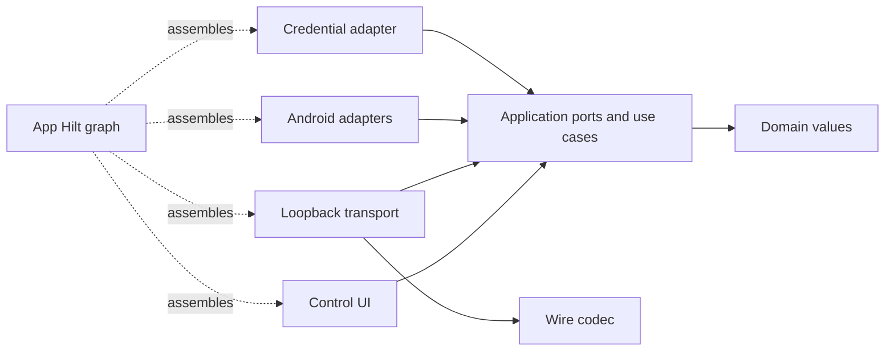

# Companion architecture

Companion owns Android execution. The unchanged USIX runtimes invoke its authenticated loopback HTTP API through their existing tools. The application layer accepts typed requests, validates scope and arguments, calls injected ports, and returns dispatch acknowledgement. It never reports a gesture, reply dispatch or email draft as verified business completion.

## Modules and dependencies

| Module | Responsibility | Production project dependencies |
| --- | --- | --- |
| `:core:domain` | Immutable package/notification references, observations, draft values and results. | None. |
| `:core:application` | Device queries/actions, validation, readiness guards and UI serialization; inbound/outbound ports. | Domain. |
| `:protocol` | Legacy wire DTOs, endpoint recognition and JSON codec. | None. |
| `:adapters:transport` | Bounded authenticated loopback HTTP, wire/core mapping, socket and request lifetime. | Application/domain, protocol. |
| `:adapters:android` | Accessibility operations/connection, app/mail intents, notification values and live reply handles. | Application/domain. |
| `:adapters:persistence` | Installed v1 bearer preference storage, random generation and constant-time verification. | Application/domain. |
| `:feature:control` | Compose setup screen and ViewModel with lifecycle-aware `StateFlow` collection. | Application/domain. |
| `:app` | Manifest, Hilt graph, activity/service lifecycle and platform setup entry points. | Production modules required for assembly. |
| `:testing:fixtures` | Per-test fake device ports. Never a production APK dependency. | Application/domain. |



`DeviceQuery` and `ExecuteDeviceAction` are the inbound interfaces. `ScreenObservationPort`, `UiActionPort`, `AppLauncherPort`, `NotificationPort`, `DeviceStatePort`, `CredentialVerifier` and `PairingCredentials` are the implemented outbound/setup interfaces. Android handles, JSON, contexts and DI annotations never cross a core port. Wire DTOs are separate from domain types; the transport maps between them.

The composition root supplies `Dispatchers.Main.immediate` to Android adapters. Accessibility observations/actions, intents and notification reply dispatch run there. Gesture callbacks suspend with a three-second limit; they do not block the main thread. A core mutex serializes taps, typing, back, scrolling, app launches and composer launches. Cancellation while queued prevents dispatch; a dispatched effect cannot be undone by cancelling a coroutine.

The injected accessibility connection releases only the service instance it owns. Notification reconnect discards old observations/handles and reconstructs the newest fifty from active system notifications. Replacement, removal, cancellation and access loss invalidate reply handles. Notification readiness does not gate app launch or accessibility use.

The foreground service owns loopback server startup/shutdown. The server binds only `127.0.0.1:8760`, authenticates before reading effect bodies, bounds headers to 16 KiB and bodies to 64 KiB, bounds reads to ten seconds, and uses four workers with sixteen queued connections. Shutdown cancels request coroutines and closes listener/client sockets. Instances, ports and limits can be injected in tests without binding the production port.

## Compatibility

The unversioned endpoints and their existing response fields remain in [README](../README.md). `/health` is public liveness and reports whether the presented bearer matches. Other endpoints require authentication. Package-scoped observation, typing and scrolling cannot fall back to another app. Invalid explicit package fields retain their error state until application validation; they cannot become an omitted scope. Compose always returns `sent: false`.

The installed `bridge` SharedPreferences `token` key, application ID, minimum API 24 and development signing key are preserved. Token rotation immediately invalidates the old token on the shared injected verifier. JSON, secrets and screen contents are not logged. This phase does not change either runtime, their tool admission or approvals.

## Enforced checks

`checkArchitecture` runs [source/API checks](../tools/check_architecture.py), enforces the production project graph, and checks resolved core compile/runtime dependencies against explicit Kotlin/coroutines allowlists. Core code cannot import Android, JSON, persistence/transport/DI types or read ambient time, environment, files, sockets or default dispatchers. Tests may depend on fixtures and adapters; application tests use ports/fakes. Debug and release source sets are checked too.

Shared [JVM](../gradle/kotlin-jvm.gradle) and [Android library](../gradle/android-library.gradle) conventions set the Java/Kotlin target and SDK/test configuration. Versions are pinned in the catalog; the P0 Gradle/AGP/Kotlin/SDK tuple is retained. Compose compiler 1.5.14 matches Kotlin 1.9.24 in the [official compatibility map](https://developer.android.com/jetpack/androidx/releases/compose-kotlin). Hilt 2.51.1 is a pinned compatible addition, using the [documented kapt setup](https://dagger.dev/hilt/gradle-setup.html); this is not a general toolchain upgrade.

Build/check the JVM modules without configuring any Android project:

```sh
ANDROID_HOME=/nonexistent/companion-sdk ANDROID_SDK_ROOT=/nonexistent/companion-sdk \
./gradlew -PcoreOnly=true checkArchitecture :core:domain:check :core:application:check \
  :protocol:check :adapters:transport:check --no-daemon
python3 -m unittest discover -s tests/architecture -v
```

The same boundary task is part of Gradle `check` and the independent CI core job. See [build reproduction](build.md) for Android/Termux commands.

## Subsequent work

The [v2 contract](../contracts/device/v2/README.md) is implemented by P2's `DeviceExecution` application service, `ExecutionRepository`, injected clock/IDs/credential crypto/readiness and local/remote control ports. Room joins receipts, grant budgets and outbox updates; DataStore/Keystore hold remote connection settings; the transport maps strict wire DTOs and owns bounded loopback/OkHttp WSS. The standalone host package owns captured profiles and supervised routing, with no runtime imports or planner. See [device integration](device-integration.md) for the implemented capability/authority boundary and explicit limitations. P2 acceptance is complete in [permanent evidence](evidence/P2-checkpoint.md), including genuine model/device traces, physical loopback/WSS and reboot recovery. P3 adds `DeviceObservations`/`RichObservationPort`, immutable snapshot/selector/criterion types, a bounded ephemeral cache and separate UI-state verifier references. Android generations and injected main/IO dispatchers keep final targeting on main and Room admission off main. [Observation contract and qualification](observations.md) describe fixture-only effect authority and the pending physical/runtime gates. The legacy API has no caller action ID or durable receipt and must not automatically retry mutations after an uncertain response.
